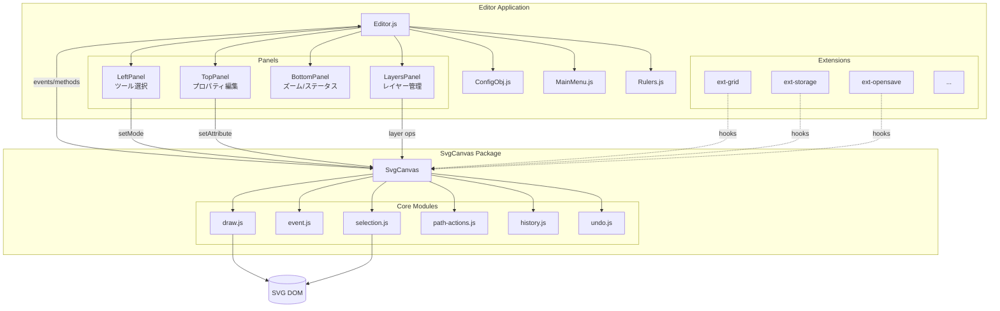
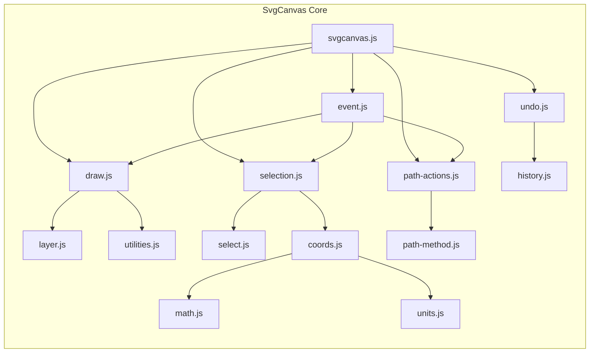
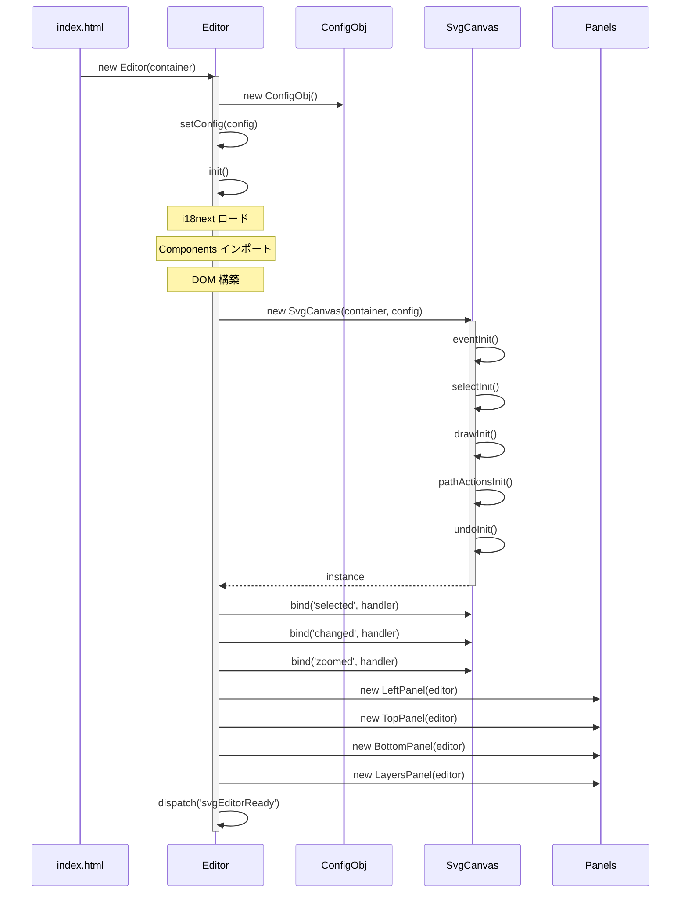
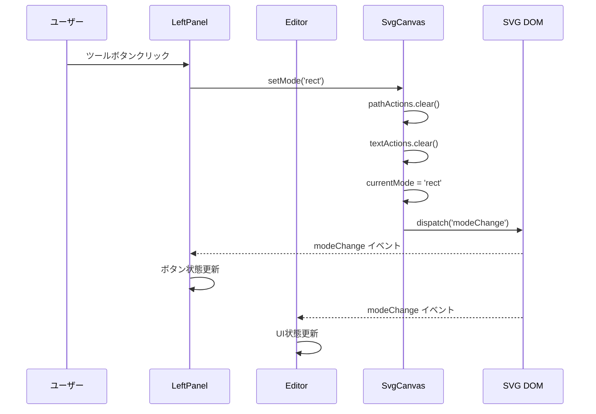
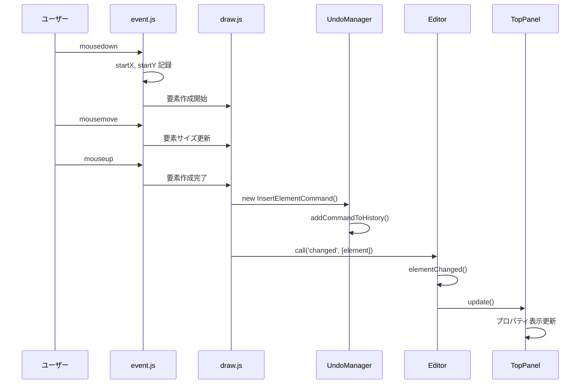
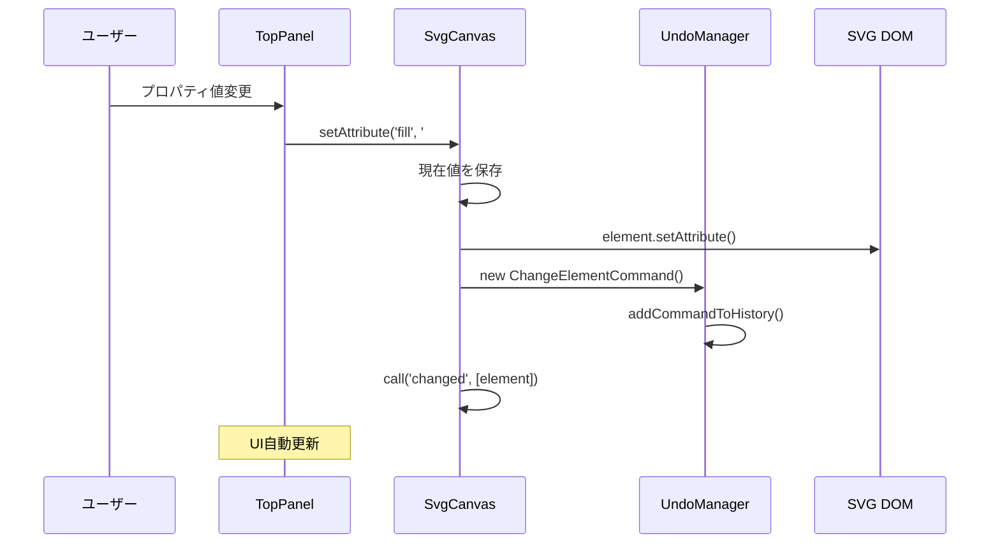
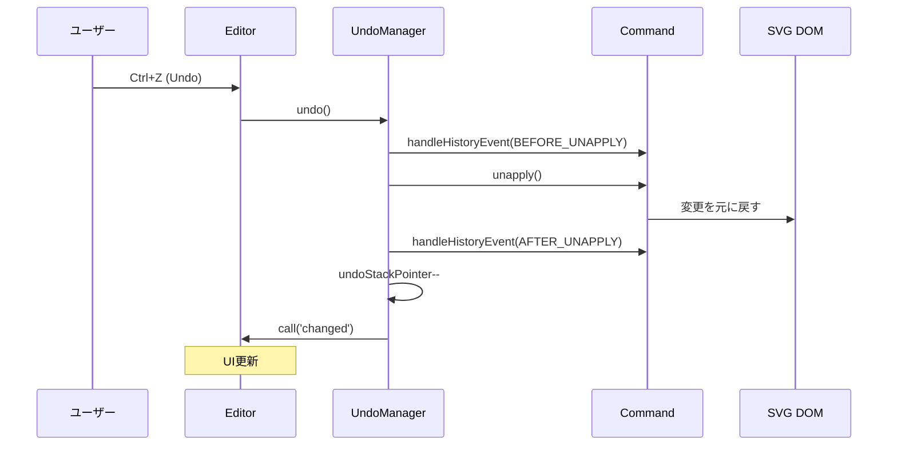
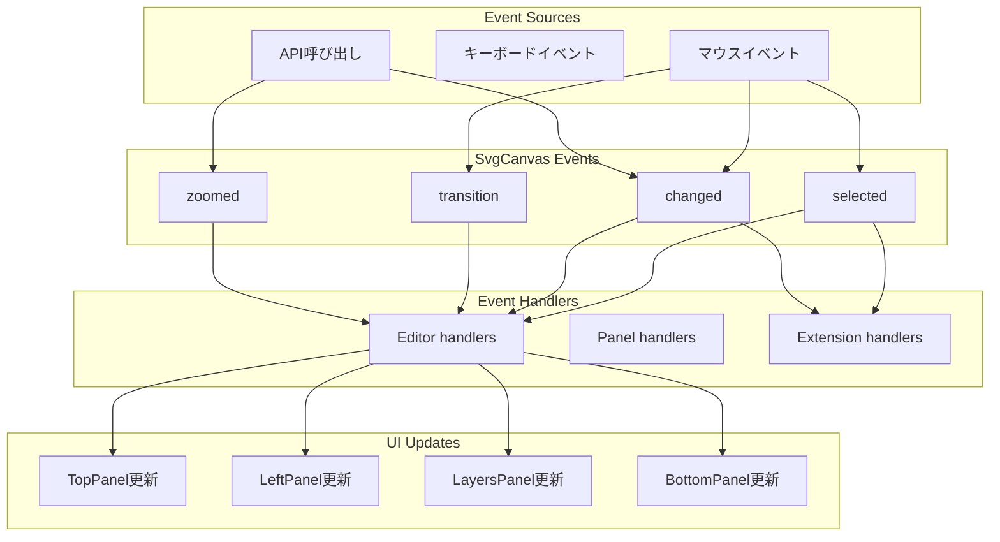
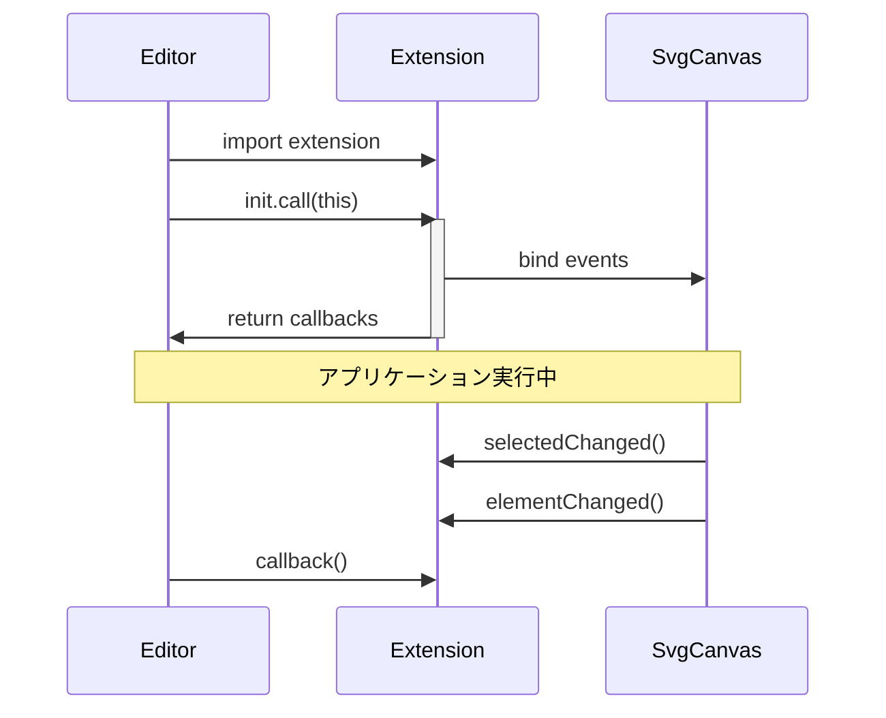

# SVG-Edit Architecture Documentation

このドキュメントはSVG-Editのアーキテクチャを解説します。モジュール構造、動作シーケンス、コンポーネント間の関係性を図解とともに説明します。

## 目次

1. [概要](#概要)
2. [ディレクトリ構造](#ディレクトリ構造)
3. [アーキテクチャ概観](#アーキテクチャ概観)
4. [コアコンポーネント](#コアコンポーネント)
5. [モジュール構造](#モジュール構造)
6. [動作シーケンス](#動作シーケンス)
7. [イベントシステム](#イベントシステム)
8. [状態管理](#状態管理)
9. [デザインパターン](#デザインパターン)
10. [拡張機能システム](#拡張機能システム)

---

## 概要

SVG-Editは、ブラウザベースのベクターグラフィックスエディタです。主に以下の特徴を持ちます：

- **モジュラー設計**: コアキャンバス機能(`@svgedit/svgcanvas`)とエディタUIが分離
- **イベント駆動**: SvgCanvasとEditorはイベントを介して疎結合に連携
- **拡張可能**: プラグインシステムにより機能拡張が容易
- **Web Components**: UIコンポーネントはカスタムエレメントとして実装

---

## ディレクトリ構造

```
svgedit/
├── src/
│   └── editor/                    # エディタアプリケーション
│       ├── Editor.js              # メインエディタクラス
│       ├── EditorStartup.js       # エディタ初期化ロジック
│       ├── ConfigObj.js           # 設定管理
│       ├── MainMenu.js            # メニューとドキュメントプロパティ
│       ├── Rulers.js              # ルーラー表示
│       ├── components/            # Web Components (UI部品)
│       │   ├── seButton.js        # ボタンコンポーネント
│       │   ├── seInput.js         # 入力コンポーネント
│       │   ├── seMenu.js          # メニューコンポーネント
│       │   └── ...
│       ├── dialogs/               # ダイアログコンポーネント
│       │   ├── cmenuDialog.js     # コンテキストメニュー
│       │   ├── exportDialog.js    # エクスポートダイアログ
│       │   └── ...
│       ├── panels/                # パネルコンポーネント
│       │   ├── LeftPanel.js       # ツール選択パネル
│       │   ├── TopPanel.js        # プロパティパネル
│       │   ├── BottomPanel.js     # ステータス/ズームパネル
│       │   └── LayersPanel.js     # レイヤーパネル
│       ├── extensions/            # プラグイン拡張機能
│       └── locale/                # i18n翻訳ファイル
│
└── packages/
    └── svgcanvas/                 # コアキャンバスライブラリ
        ├── svgcanvas.js           # SvgCanvasメインクラス
        ├── core/                  # コア機能モジュール
        │   ├── draw.js            # 描画・レイヤー管理
        │   ├── event.js           # イベントハンドリング
        │   ├── selection.js       # 選択処理
        │   ├── path.js            # パス処理
        │   ├── history.js         # Undo/Redoコマンド
        │   └── ...
        └── common/                # 共有ユーティリティ
```

---

## アーキテクチャ概観

### 三層アーキテクチャ

```
┌─────────────────────────────────────────────────────────────────┐
│                    ユーザーインターフェース層                      │
│  ┌──────────┐  ┌──────────┐  ┌──────────┐  ┌──────────────────┐ │
│  │LeftPanel │  │ TopPanel │  │BottomPanel│ │   LayersPanel   │ │
│  │(ツール)   │  │(プロパティ)│  │(ステータス)│ │    (レイヤー)    │ │
│  └──────────┘  └──────────┘  └──────────┘  └──────────────────┘ │
│                           ↕ イベント                              │
│  ┌─────────────────────────────────────────────────────────────┐ │
│  │                      Editor (制御層)                         │ │
│  │    状態管理 / イベントハンドリング / 拡張機能管理               │ │
│  └─────────────────────────────────────────────────────────────┘ │
└─────────────────────────────────────────────────────────────────┘
                              ↕ API呼び出し / イベント
┌─────────────────────────────────────────────────────────────────┐
│                      SvgCanvas (キャンバスエンジン)               │
│  ┌──────────┐ ┌──────────┐ ┌──────────┐ ┌──────────┐           │
│  │  draw    │ │  event   │ │selection │ │  path    │  ...      │
│  └──────────┘ └──────────┘ └──────────┘ └──────────┘           │
│                              ↕                                   │
│  ┌─────────────────────────────────────────────────────────────┐ │
│  │                      SVG DOM                                 │ │
│  └─────────────────────────────────────────────────────────────┘ │
└─────────────────────────────────────────────────────────────────┘
```

### コンポーネント相関図



---

## コアコンポーネント

### Editor (`src/editor/Editor.js`)

アプリケーション全体を統括するメインコントローラー。

```javascript
class Editor extends EditorStartup {
  // 主な責務:
  // - 初期化とセットアップ
  // - SvgCanvasイベントのハンドリング
  // - パネル間の状態同期
  // - キーボードショートカット管理
  // - 拡張機能の管理
}
```

**主要プロパティ:**
| プロパティ | 説明 |
|-----------|------|
| `svgCanvas` | SvgCanvasインスタンス |
| `selectedElement` | 現在選択中の要素 |
| `multiselected` | 複数選択フラグ |
| `configObj` | 設定オブジェクト |

### SvgCanvas (`packages/svgcanvas/svgcanvas.js`)

SVG描画エンジンの中核。独立したnpmパッケージとして公開されている。

```javascript
class SvgCanvas {
  constructor(container, config) {
    // コアモジュールの初期化
    eventInit(this)       // イベントハンドリング
    selectInit(this)      // セレクター管理
    drawInit(this)        // 描画機能
    pathActionsInit(this) // パス編集
    undoInit(this)        // Undo/Redo
    // ...
  }
}
```

**主要メソッド:**
| メソッド | 説明 |
|---------|------|
| `setMode(mode)` | 編集モード切替（select, rect, path等）|
| `setAttribute(attr, val)` | 選択要素の属性変更 |
| `getSelectedElements()` | 選択要素の取得 |
| `addSVGElementsFromJson()` | JSON形式で要素を追加 |
| `undo()` / `redo()` | 操作の取り消し/やり直し |

### パネルコンポーネント

| パネル | ファイル | 責務 |
|--------|----------|------|
| LeftPanel | `panels/LeftPanel.js` | ツール選択ボタンの管理 |
| TopPanel | `panels/TopPanel.js` | 要素プロパティの表示・編集 |
| BottomPanel | `panels/BottomPanel.js` | ズームコントロール、ステータス表示 |
| LayersPanel | `panels/LayersPanel.js` | レイヤーの表示・管理 |

---

## モジュール構造

### SvgCanvas コアモジュール

SvgCanvasは33以上の専門モジュールで構成されています：

```
packages/svgcanvas/core/
├── 描画系
│   ├── draw.js          # 描画管理、レイヤー操作
│   ├── elem-get-set.js  # 要素属性のget/set
│   └── selected-elem.js # 選択要素のプロパティ操作
│
├── イベント系
│   ├── event.js         # マウス/キーボードイベント
│   └── text-actions.js  # テキスト編集アクション
│
├── 選択系
│   ├── selection.js     # 選択処理、交差判定
│   └── select.js        # セレクター/グリップ管理
│
├── パス系
│   ├── path.js          # パスデータ構造
│   ├── path-actions.js  # パス編集アクション
│   └── path-method.js   # パス操作メソッド
│
├── 履歴系
│   ├── history.js       # コマンドクラス定義
│   └── undo.js          # UndoManager
│
├── 変換系
│   ├── coords.js        # 座標変換
│   ├── math.js          # 行列演算
│   ├── recalculate.js   # BBox再計算
│   └── units.js         # 単位変換
│
└── ユーティリティ系
    ├── utilities.js     # 汎用ユーティリティ
    ├── sanitize.js      # SVGサニタイズ
    ├── json.js          # JSON変換
    └── browser.js       # ブラウザ互換
```

### モジュール依存関係図



---

## 動作シーケンス

### 1. アプリケーション起動シーケンス



### 2. ツール選択シーケンス



### 3. 要素描画シーケンス



### 4. プロパティ変更シーケンス



### 5. Undo/Redo シーケンス



---

## イベントシステム

### SvgCanvas イベント一覧

```javascript
// SvgCanvasが発火するイベント
const events = {
  'selected':       // 選択が変更された
  'transition':     // 要素がドラッグ/変形中
  'changed':        // 要素のプロパティが変更された
  'zoomed':         // ズームレベルが変更された
  'zoomDone':       // ズーム操作完了
  'exported':       // 画像がエクスポートされた
  'beforeClear':    // ドキュメントクリア前
  'afterClear':     // ドキュメントクリア後
  'contextset':     // グループコンテキスト変更
  'extension_added':// 拡張機能が読み込まれた
  'elementRenamed': // レイヤー/要素名が変更された
  'message':        // メッセージ通知
}
```

### イベントフロー図



### イベント購読の例

```javascript
// Editor での購読
this.svgCanvas.bind('selected', (win, elems) => {
  this.selectedElement = elems.length === 1 ? elems[0] : null
  this.multiselected = elems.length > 1
  this.topPanel.update()
})

// 拡張機能での購読
svgCanvas.bind('changed', (win, elems) => {
  // 要素変更時の処理
})
```

---

## 状態管理

### Editor 状態

```javascript
// Editor が管理する状態
{
  selectedElement: Element | null,  // 選択中の要素
  multiselected: boolean,           // 複数選択フラグ
  langChanged: boolean,             // 言語変更フラグ
  showSaveWarning: boolean,         // 保存警告フラグ
  storagePromptState: string,       // ストレージ許可状態
  isReady: boolean,                 // 初期化完了フラグ
  shortcuts: Array,                 // キーボードショートカット
  curConfig: Object                 // 現在の設定
}
```

### SvgCanvas 状態

```javascript
// SvgCanvas が管理する状態
{
  currentMode: string,              // 現在の編集モード
  currentResizeMode: string,        // リサイズモード
  selectedElements: Array,          // 選択要素配列
  currentZoom: number,              // ズームレベル
  undoMgr: UndoManager,             // Undo管理
  curBBoxes: Array,                 // 選択要素のBBox
  curStyles: Object,                // 現在のスタイル設定
}
```

### 状態更新フロー

```
ユーザーアクション
       ↓
SvgCanvas 内部状態更新
       ↓
イベント発火 (call)
       ↓
Editor 状態更新
       ↓
Panel 状態読み取り
       ↓
UI 再レンダリング
```

---

## デザインパターン

### 1. イベント駆動パターン (Observer)

```javascript
// SvgCanvas のイベントシステム
class SvgCanvas {
  events = {}

  bind(eventName, handler) {
    this.events[eventName] = handler
  }

  call(eventName, ...args) {
    if (this.events[eventName]) {
      this.events[eventName](window, ...args)
    }
  }
}
```

### 2. コマンドパターン (Undo/Redo)

```javascript
// history.js でのコマンドクラス
class ChangeElementCommand {
  constructor(elem, attrs, text) {
    this.elem = elem
    this.attrs = attrs
    this.text = text
    this.oldValues = {}
    // 現在値を保存
    for (const attr in attrs) {
      this.oldValues[attr] = elem.getAttribute(attr)
    }
  }

  apply(handler) {
    // 新しい値を適用
    for (const attr in this.attrs) {
      this.elem.setAttribute(attr, this.attrs[attr])
    }
    handler.handleHistoryEvent(HistoryEventTypes.AFTER_APPLY, this)
  }

  unapply(handler) {
    // 古い値に戻す
    for (const attr in this.oldValues) {
      this.elem.setAttribute(attr, this.oldValues[attr])
    }
    handler.handleHistoryEvent(HistoryEventTypes.AFTER_UNAPPLY, this)
  }
}
```

### 3. モジュールパターン (初期化関数)

```javascript
// 各モジュールは init 関数をエクスポート
export const init = (canvas) => {
  // canvas にメソッドを追加
  canvas.methodName = function() {
    // 実装
  }
}

// SvgCanvas で使用
import { init as eventInit } from './core/event.js'
eventInit(this)
```

### 4. ファクトリパターン (Drawing)

```javascript
// Drawing クラスが要素生成を担当
class Drawing {
  createLayer(name, pos, hrService) {
    const svgElem = this.svgElem_
    const layer = new Layer(name, g, svgElem)
    // ...
  }
}
```

---

## 拡張機能システム

### 拡張機能の構造

```javascript
// 拡張機能の基本構造
export default {
  name: 'ext-example',

  async init() {
    const { svgCanvas } = this

    return {
      // コールバック関数を返す
      callback() {
        console.log('Extension callback')
      },

      // ボタン定義
      buttons: [{
        id: 'example_button',
        icon: 'example.svg',
        type: 'mode',
        events: {
          click() {
            svgCanvas.setMode('example')
          }
        }
      }],

      // コンテキストメニュー項目
      context_tools: [],

      // イベントハンドラ
      selectedChanged(opts) {
        // 選択変更時の処理
      },

      elementChanged(opts) {
        // 要素変更時の処理
      }
    }
  }
}
```

### デフォルト拡張機能

| 拡張機能 | 説明 |
|---------|------|
| `ext-grid` | グリッド表示とスナップ機能 |
| `ext-storage` | LocalStorageによる自動保存 |
| `ext-opensave` | ファイル開く/保存ダイアログ |
| `ext-panning` | パンツール |
| `ext-shapes` | 定義済み図形ライブラリ |
| `ext-markers` | SVGマーカーサポート |
| `ext-polystar` | 多角形/星形ツール |

### 拡張機能ライフサイクル



---

## 通信チャネルまとめ

| 送信元 | 送信先 | 方式 |
|--------|--------|------|
| SvgCanvas | Editor | イベント (`selected`, `changed` 等) |
| Editor | SvgCanvas | メソッド呼び出し (`setMode`, `setAttribute` 等) |
| Panels | Editor | プロパティ参照 |
| Editor | Panels | プロパティ更新 → 自動再描画 |
| Extensions | SvgCanvas | `bind()` でイベント購読 |
| Config | All | `ConfigObj` を通じた設定共有 |

---

## 関連リソース

- [SVG-Edit GitHub Repository](https://github.com/SVG-Edit/svgedit)
- [@svgedit/svgcanvas NPM Package](https://www.npmjs.com/package/@svgedit/svgcanvas)
- [SVG-Edit Wiki](https://github.com/SVG-Edit/svgedit/wiki)
