# SVG-Edit アーキテクチャ解説

## 目次

1. [概要](#概要)
2. [プロジェクト構造](#プロジェクト構造)
3. [システムアーキテクチャ](#システムアーキテクチャ)
4. [コアモジュール詳細](#コアモジュール詳細)
5. [UIレイヤー](#uiレイヤー)
6. [拡張機能システム](#拡張機能システム)
7. [状態管理](#状態管理)
8. [イベントシステム](#イベントシステム)
9. [データフロー](#データフロー)
10. [ビルドシステム](#ビルドシステム)

---

## 概要

SVG-Editは、ブラウザベースのベクターグラフィックエディタです。HTML5、JavaScript、SVGを活用し、プラグインによる拡張が可能な設計となっています。

### 主要な技術スタック

| カテゴリ | 技術 |
|---------|------|
| フロントエンド | Vanilla JavaScript (ES Modules) |
| UI コンポーネント | Web Components (Custom Elements) |
| UIライブラリ | Elix |
| ビルドツール | Vite 7.x |
| テスト | Vitest + Playwright |
| 国際化 | i18next |
| PDF出力 | jsPDF + svg2pdf.js |

### アーキテクチャの特徴

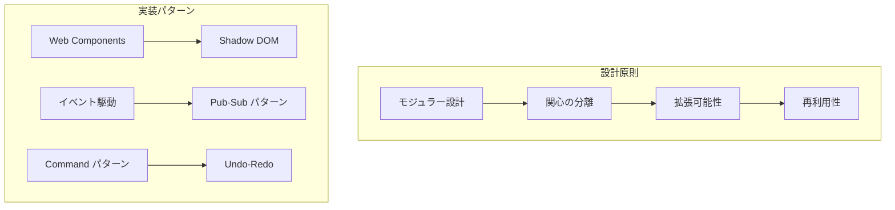

---

## プロジェクト構造

### ディレクトリ構成

```
svgedit/
├── packages/                    # ワークスペースパッケージ
│   ├── svgcanvas/              # コアキャンバスライブラリ
│   │   ├── core/               # コア機能モジュール (33個)
│   │   ├── common/             # 共有ユーティリティ
│   │   └── svgcanvas.js        # エントリーポイント
│   └── react-test/             # React統合テスト
│
├── src/editor/                  # エディタUI
│   ├── components/             # UIコンポーネント (22個)
│   ├── dialogs/                # ダイアログ (20個)
│   ├── extensions/             # 拡張機能 (12個)
│   ├── panels/                 # パネル (4個)
│   ├── locale/                 # 多言語ファイル (30+言語)
│   ├── images/                 # アイコン・カーソル
│   ├── Editor.js               # メインエディタクラス
│   ├── EditorStartup.js        # 起動処理
│   └── ConfigObj.js            # 設定管理
│
├── tests/                       # テストスイート
│   ├── unit/                   # ユニットテスト (Vitest)
│   └── e2e/                    # E2Eテスト (Playwright)
│
├── scripts/                     # ビルドスクリプト
├── docs/                        # ドキュメント
└── vite.config.mjs             # Vite設定
```

### パッケージ依存関係

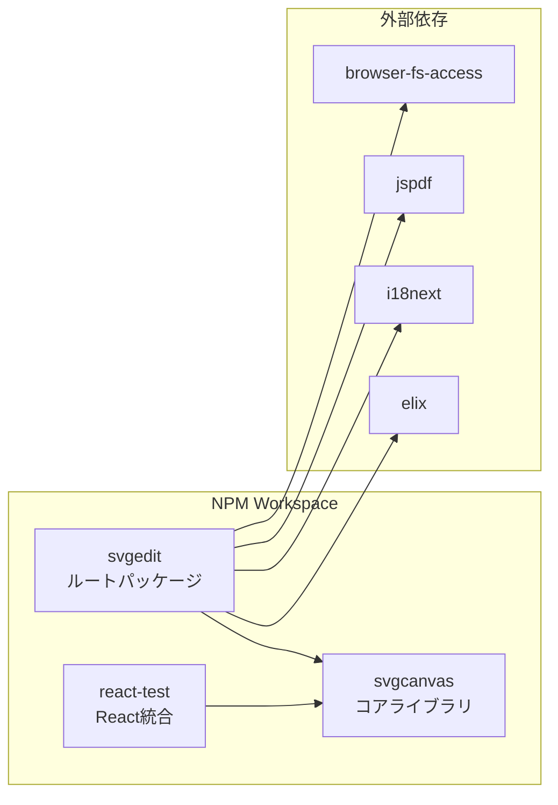

---

## システムアーキテクチャ

### 全体構成図

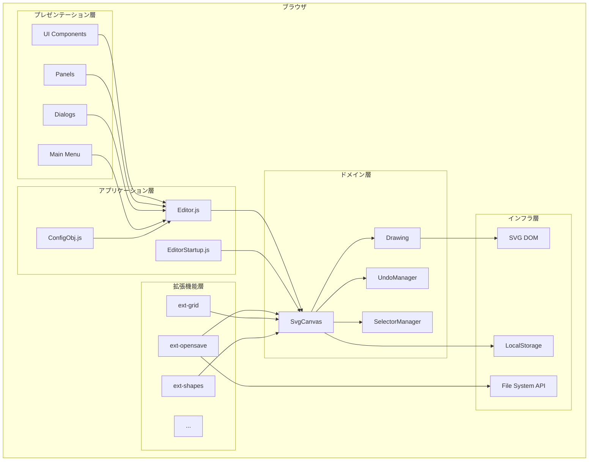

### レイヤー構成

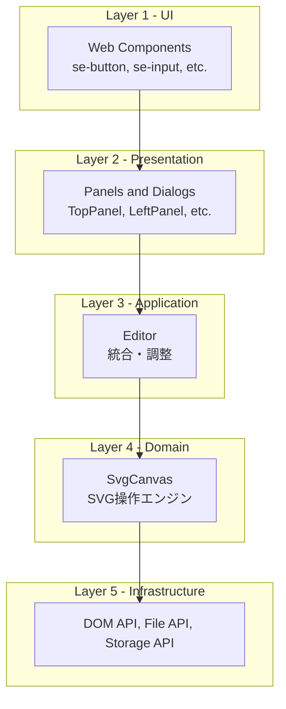

---

## コアモジュール詳細

### SvgCanvas モジュール構成

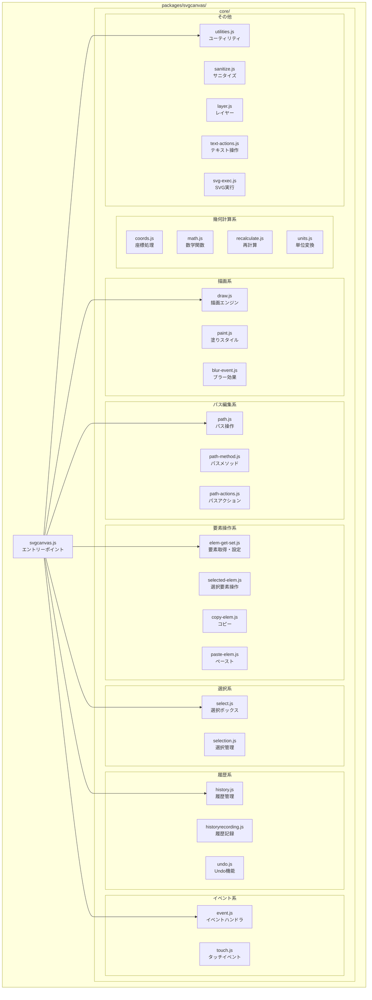

### 主要クラスの関係

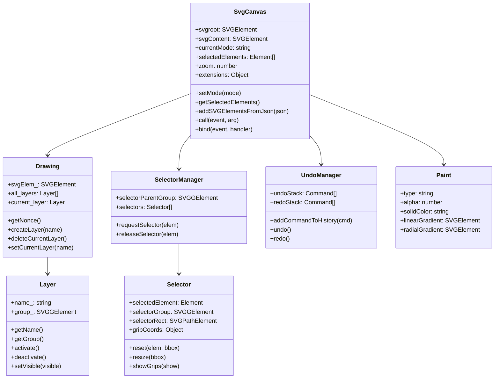

### コアモジュールのファイルサイズ

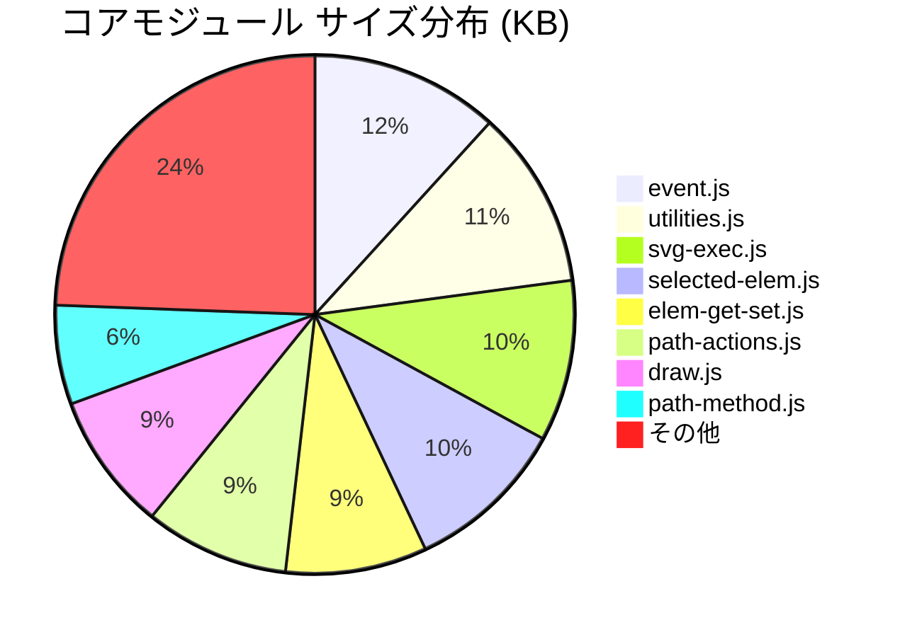

---

## UIレイヤー

### コンポーネント構成

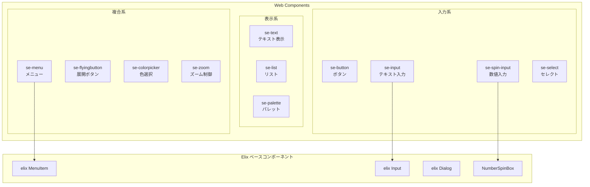

### パネルレイアウト

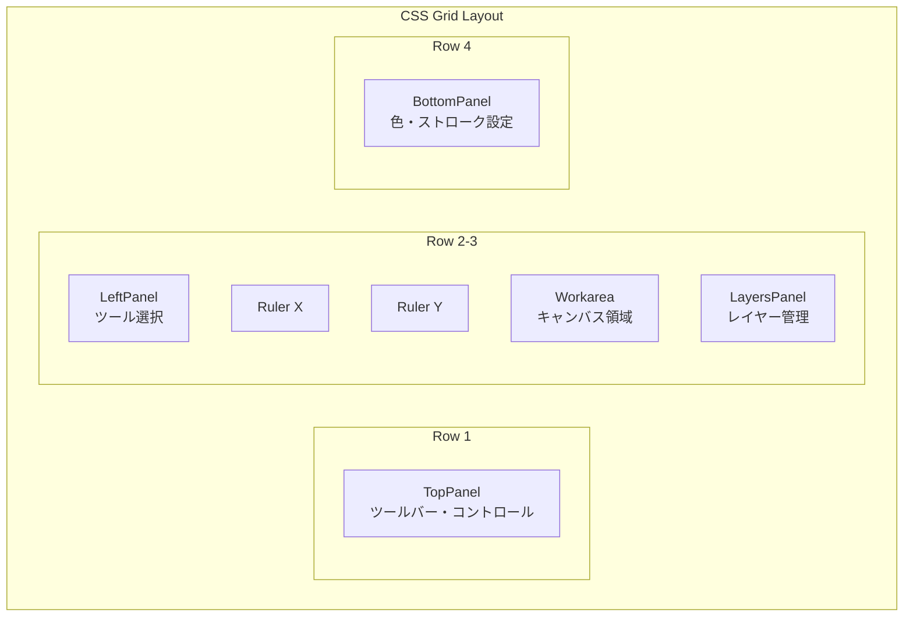

### グリッドテンプレート

```
┌────────────────────────────────────────────────────────┐
│                    TopPanel (main, top)                 │
├─────┬────────┬────────────────────────────┬────────────┤
│     │ corner │        Ruler X             │            │
│ L   ├────────┼────────────────────────────┤   Side     │
│ e   │        │                            │   Panel    │
│ f   │ Ruler  │       Workarea             │   (layers) │
│ t   │   Y    │       (canvas)             │            │
│     │        │                            │            │
├─────┴────────┴────────────────────────────┴────────────┤
│                    BottomPanel                          │
└────────────────────────────────────────────────────────┘
```

### ダイアログシステム

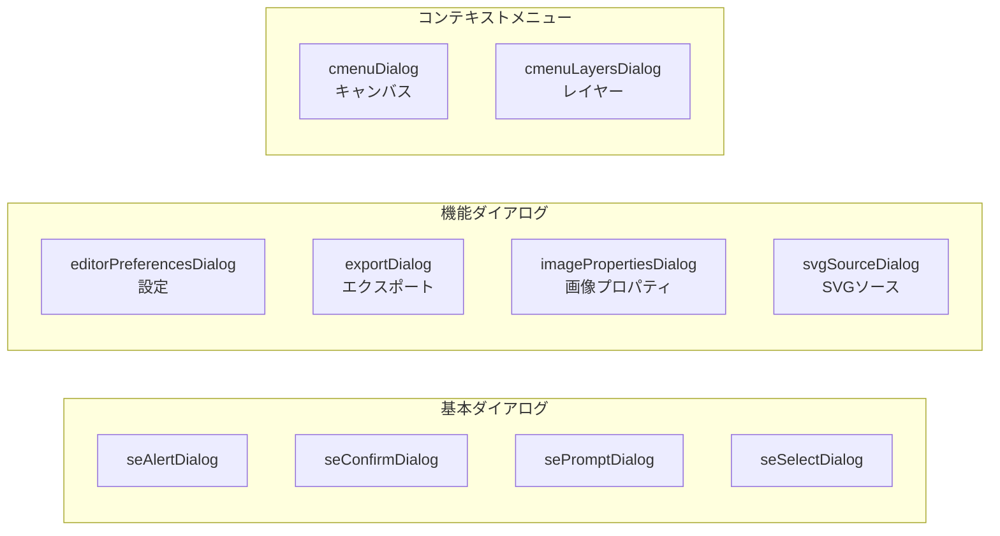

---

## 拡張機能システム

### 拡張機能アーキテクチャ

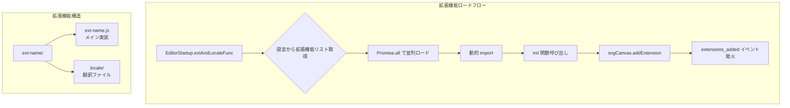

### 標準拡張機能一覧

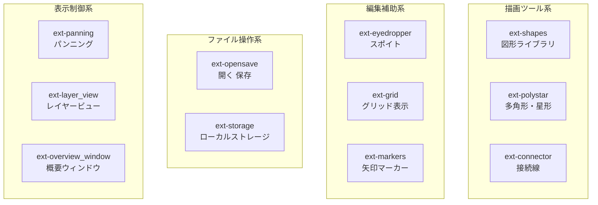

### 拡張機能インターフェース

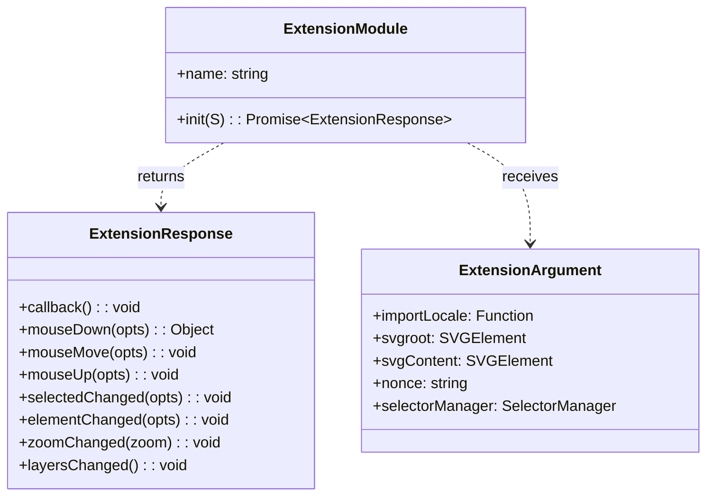

### 拡張機能ライフサイクル

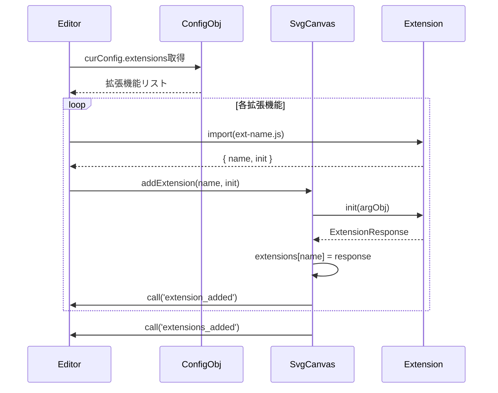

---

## 状態管理

### 状態の階層構造

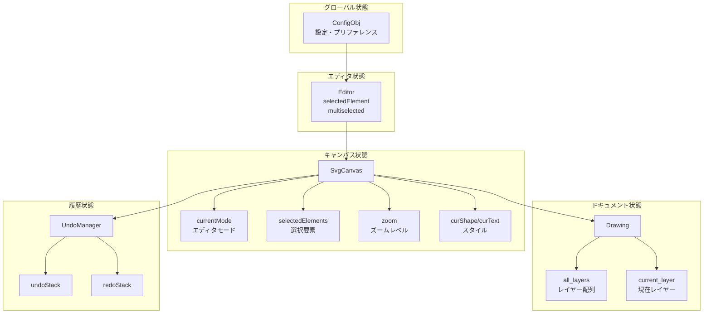

### 状態変更フロー

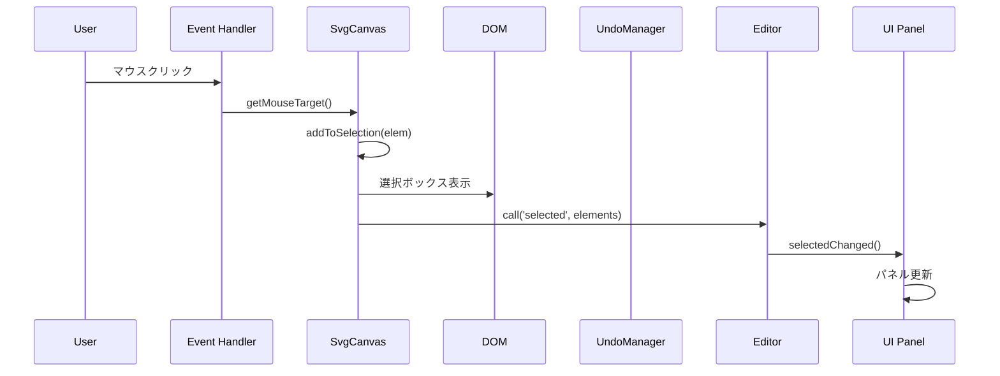

### Undo/Redo システム

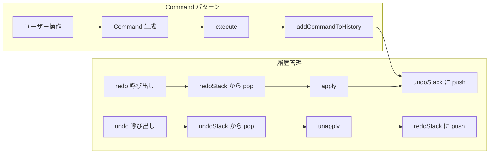

### Command クラス階層

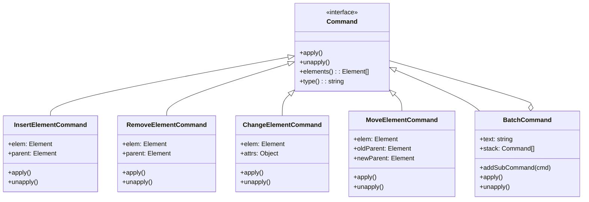

---

## イベントシステム

### イベントフロー概要

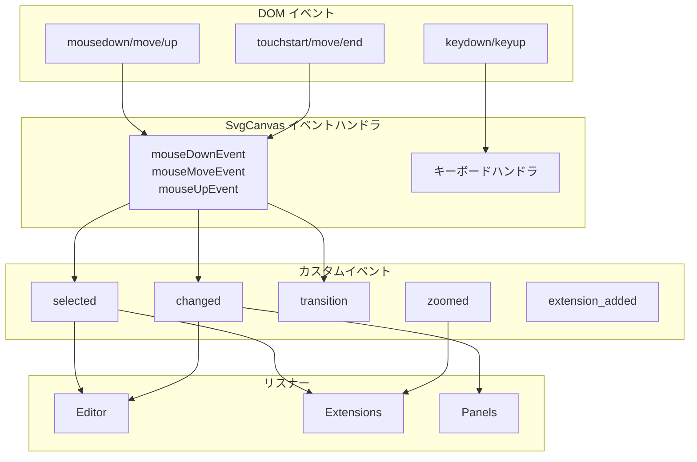

### 主要イベント一覧

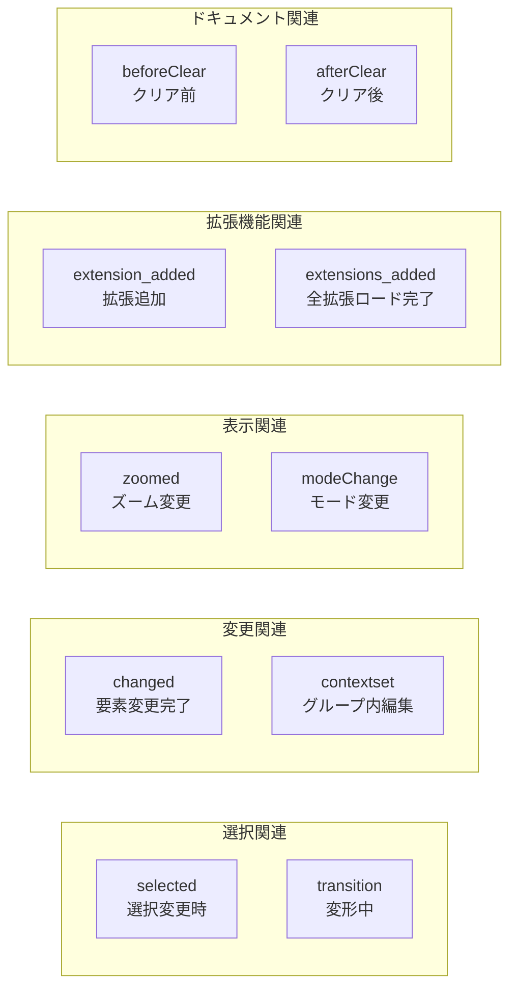

### イベント発火シーケンス（要素選択）

```mermaid
sequenceDiagram
    participant U as User
    participant DOM as SVG DOM
    participant E as event.js
    participant Sel as selection.js
    participant SM as SelectorManager
    participant Ed as Editor
    participant TP as TopPanel
    participant Ext as Extensions

    U->>DOM: click
    DOM->>E: mousedown event
    E->>E: getMouseTarget()
    E->>Sel: addToSelection(elem)
    Sel->>SM: requestSelector(elem)
    SM->>SM: セレクタ表示
    Sel->>Ed: call('selected', elements)

    par 並列処理
        Ed->>TP: selectedChanged()
        TP->>TP: updateContextPanel()
    and
        Ed->>Ext: selectedChanged()
    end
```

### イベント発火シーケンス（図形描画）

```mermaid
sequenceDiagram
    participant U as User
    participant E as event.js
    participant S as SvgCanvas
    participant D as draw.js
    participant H as history.js
    participant Ed as Editor

    U->>E: mousedown (開始点)
    E->>S: getMode() = 'rect'
    E->>D: 矩形要素作成
    D->>D: started = true

    loop ドラッグ中
        U->>E: mousemove
        E->>D: 矩形サイズ更新
    end

    U->>E: mouseup (終了点)
    E->>D: 要素確定
    D->>S: addToSelection(rect)
    D->>H: InsertElementCommand
    H->>H: addCommandToHistory
    S->>Ed: call('changed', [rect])
    Ed->>Ed: elementChanged()
```

---

## データフロー

### SVG 読み込みフロー

```mermaid
sequenceDiagram
    participant U as User
    participant OS as ext-opensave
    participant Ed as Editor
    participant S as SvgCanvas
    participant San as sanitize.js
    participant D as Drawing

    U->>OS: ファイル選択
    OS->>OS: FileReader.readAsText()
    OS->>Ed: loadSvgString(svgStr)
    Ed->>S: setSvgString(svgStr)
    S->>San: sanitizeSvg(svgStr)
    San-->>S: 安全なSVG
    S->>D: Drawing 初期化
    D->>D: レイヤー解析
    S->>S: call('changed')
    S->>Ed: call('extensions_added')
```

### SVG 保存フロー

```mermaid
sequenceDiagram
    participant U as User
    participant OS as ext-opensave
    participant S as SvgCanvas
    participant Exec as svg-exec.js
    participant FS as File System API

    U->>OS: 保存ボタン
    OS->>S: getSvgString()
    S->>Exec: svgCanvasToString()
    Exec->>Exec: XML シリアライズ
    Exec-->>S: SVG 文字列
    S-->>OS: SVG データ
    OS->>FS: fileSave(blob)
    FS-->>U: ファイル保存
```

### PDF エクスポートフロー

```mermaid
sequenceDiagram
    participant U as User
    participant Exp as exportDialog
    participant S as SvgCanvas
    participant PDF as jsPDF
    participant S2P as svg2pdf.js

    U->>Exp: PDF エクスポート選択
    Exp->>S: getSvgString()
    S-->>Exp: SVG データ
    Exp->>PDF: new jsPDF()
    Exp->>S2P: svg2pdf(svg, pdf)
    S2P->>PDF: PDF 生成
    PDF-->>Exp: PDF Blob
    Exp->>U: ダウンロード
```

### 要素変更のデータフロー

```mermaid
graph LR
    subgraph Input[入力]
        A["UI 操作"] --> B["イベントハンドラ"]
    end

    subgraph Process[処理]
        B --> C["SvgCanvas メソッド"]
        C --> D["DOM 更新"]
        D --> E["Command 生成"]
        E --> F["履歴に追加"]
    end

    subgraph Output[出力]
        F --> G["イベント発火"]
        G --> H["UI 更新"]
        G --> I["拡張機能通知"]
    end
```

---

## ビルドシステム

### ビルドプロセス

```mermaid
graph TB
    subgraph BuildProcess[npm run build]
        A["開始"] --> B["svgcanvas ビルド"]
        B --> C["react-test ビルド"]
        C --> D["エディタビルド"]
        D --> E["拡張機能ビルド"]
        E --> F["静的アセットコピー"]
        F --> G["完了"]
    end

    subgraph BuildOutput[出力]
        D --> H["dist/editor/Editor.js<br/>ES Module"]
        D --> I["dist/editor/iife-Editor.js<br/>IIFE バンドル"]
        E --> J["dist/editor/extensions/"]
        F --> K["HTML, CSS, 画像"]
    end
```

### Vite 設定概要

```mermaid
graph LR
    subgraph ViteConfig[ルート vite.config.mjs]
        A["MPA 設定"] --> B["複数エントリー"]
        B --> C["index.html"]
        B --> D["iife-index.html"]
        B --> E["xdomain-index.html"]

        F["ライブラリビルド"] --> G["ES Module"]
        F --> H["IIFE"]

        I["プラグイン"]
        I --> J["htmlStringPlugin"]
        I --> K["dynamicImportVars"]
        I --> L["istanbul"]
    end
```

### テスト構成

```mermaid
graph TB
    subgraph TestSuite[テストスイート]
        A["npm run test"]
        A --> B["Vitest<br/>ユニットテスト"]
        A --> C["Playwright<br/>E2E テスト"]
    end

    subgraph VitestTests[Vitest]
        B --> D["tests/unit/*.test.js"]
        B --> E["カバレッジ計測"]
    end

    subgraph PlaywrightTests[Playwright]
        C --> F["tests/e2e/*.spec.js"]
        C --> G["ブラウザテスト"]
    end
```

---

## 開発ガイド

### 新規拡張機能の作成

```mermaid
graph TB
    A["ext-myextension/ 作成"] --> B["ext-myextension.js 作成"]
    B --> C["locale/ ディレクトリ作成"]
    C --> D["翻訳ファイル作成"]
    D --> E["ConfigObj に登録"]

    subgraph ExtImpl[実装内容]
        F["name エクスポート"]
        G["init 関数実装"]
        H["イベントハンドラ定義"]
        I["UI コールバック"]
    end

    B --> F
    B --> G
    G --> H
    G --> I
```

### 拡張機能テンプレート

```javascript
// ext-myextension.js
const name = 'myextension'

export default {
  name,
  async init(S) {
    const svgEditor = this
    const { svgCanvas } = svgEditor

    return {
      callback() {
        // UI 初期化
      },
      mouseDown(opts) {
        // マウスダウン処理
      },
      mouseUp(opts) {
        // マウスアップ処理
      },
      selectedChanged(opts) {
        // 選択変更時
      }
    }
  }
}
```

### コンポーネント作成パターン

```mermaid
graph TB
    A[HTMLElement 継承] --> B[Shadow DOM 作成]
    B --> C[テンプレート定義]
    C --> D[observedAttributes 定義]
    D --> E[attributeChangedCallback 実装]
    E --> F[connectedCallback 実装]
    F --> G[customElements.define 登録]
```

---

## パフォーマンス考慮事項

### 最適化ポイント

```mermaid
graph TB
    subgraph RenderOpt[レンダリング最適化]
        A["requestAnimationFrame 使用"]
        B["バッチ DOM 更新"]
        C["仮想化リスト"]
    end

    subgraph MemoryOpt[メモリ最適化]
        D["イベントリスナー解除"]
        E["不要な参照クリア"]
        F["履歴サイズ制限"]
    end

    subgraph CalcOpt[計算最適化]
        G["座標計算キャッシュ"]
        H["BBox 計算最小化"]
        I["変換行列再利用"]
    end
```

---

## セキュリティ考慮事項

### SVG サニタイズ

```mermaid
graph LR
    A["外部 SVG"] --> B["sanitize.js"]
    B --> C{"危険な要素チェック"}
    C -->|script タグ| D["削除"]
    C -->|イベント属性| E["削除"]
    C -->|外部参照| F["削除"]
    C -->|安全| G["許可"]
    D --> H["安全な SVG"]
    E --> H
    F --> H
    G --> H
```

### 許可される要素・属性

- **許可要素**: svg, g, rect, circle, ellipse, line, polyline, polygon, path, text, tspan, image, use, defs, clipPath, mask, pattern, linearGradient, radialGradient, stop, etc.
- **禁止要素**: script, foreignObject (条件付き)
- **禁止属性**: on* イベントハンドラ

---

## 用語集

| 用語 | 説明 |
|------|------|
| SvgCanvas | SVG 操作のコアエンジン |
| Drawing | SVG ドキュメント構造を管理するクラス |
| Layer | SVG グループ要素をラップしたレイヤークラス |
| Selector | 選択ボックスを描画・管理するクラス |
| Paint | 塗りスタイル（単色/グラデーション）を抽象化 |
| Command | Undo/Redo 用の操作コマンド |
| Extension | プラグイン形式の拡張機能 |
| Mode | エディタの現在の操作モード（select, rect, path 等） |

---

## 参考リンク

- [SVG-Edit GitHub](https://github.com/SVG-Edit/svgedit)
- [SVG 仕様](https://www.w3.org/TR/SVG2/)
- [Web Components](https://developer.mozilla.org/en-US/docs/Web/Web_Components)
- [Elix](https://component.kitchen/elix)
- [Vite](https://vitejs.dev/)
