# SVG-Edit Editor アーキテクチャ詳細

このドキュメントはSVG-EditのEditorコンポーネントを詳細に解説します。

## 目次

1. [概要](#概要)
2. [クラス構造](#クラス構造)
3. [初期化シーケンス](#初期化シーケンス)
4. [プロパティ一覧](#プロパティ一覧)
5. [パネル連携](#パネル連携)
6. [イベントハンドラ](#イベントハンドラ)
7. [キーボードショートカット](#キーボードショートカット)
8. [メニューシステム](#メニューシステム)
9. [設定管理 (ConfigObj)](#設定管理-configobj)
10. [拡張機能管理](#拡張機能管理)
11. [インポート/エクスポート](#インポートエクスポート)
12. [状態管理](#状態管理)
13. [SvgCanvas API連携](#svgcanvas-api連携)

---

## 概要

Editorは SVG-Editアプリケーション全体を統括するメインコントローラーです。

### ファイル構成

| ファイル | 行数 | 役割 |
|---------|------|------|
| `Editor.js` | 1,417行 | メインクラス、イベントハンドラ、ショートカット |
| `EditorStartup.js` | 802行 | 初期化ロジック、DOM構築 |
| `ConfigObj.js` | 496行 | 設定管理 |
| `MainMenu.js` | 285行 | メニューシステム |

### 主な責務

```
┌─────────────────────────────────────────────────────────────────┐
│                         Editor                                   │
├─────────────────────────────────────────────────────────────────┤
│  - アプリケーション初期化                                         │
│  - SvgCanvasイベントのハンドリング                                │
│  - パネル間の状態同期                                            │
│  - キーボードショートカット管理                                    │
│  - 拡張機能のロードと管理                                         │
│  - インポート/エクスポート処理                                    │
│  - 設定の読み込みと保存                                          │
└─────────────────────────────────────────────────────────────────┘
```

---

## クラス構造

### 継承関係

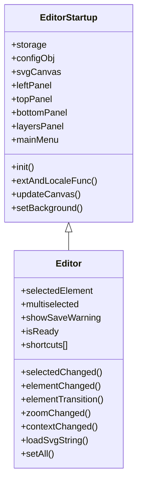

### コンポーネント関係図

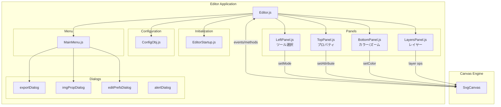

---

## 初期化シーケンス

### 起動フロー詳細

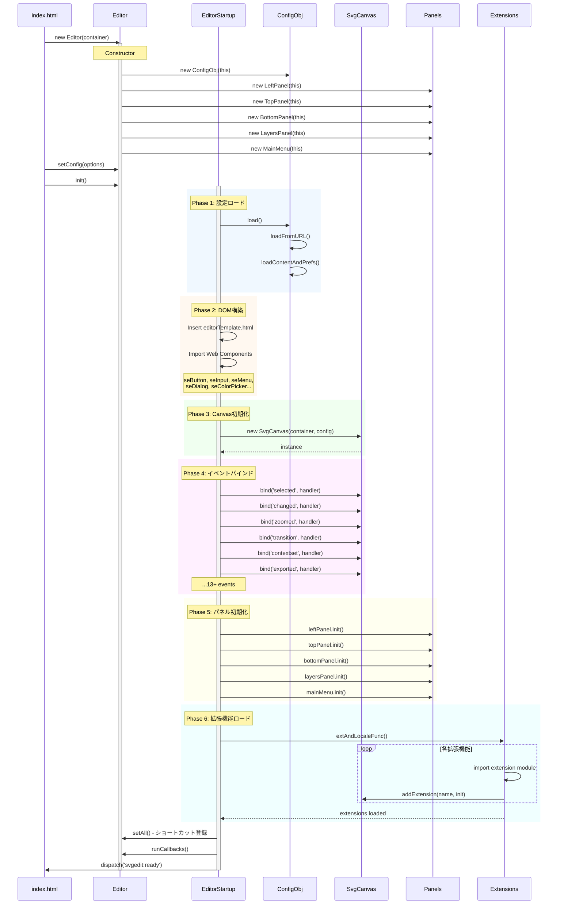

### 初期化フェーズ詳細

```
Phase 1: 設定ロード
├── localStorage確認
├── URL パラメータ解析
└── 設定のマージ

Phase 2: DOM構築
├── editorTemplate.html挿入
├── Web Components インポート
│   ├── se-button, se-input
│   ├── se-menu, se-menu-item
│   ├── se-colorpicker
│   ├── se-list, se-list-item
│   └── se-dialog系
└── ダイアログ初期化

Phase 3: Canvas初期化
├── SvgCanvas インスタンス作成
├── 内部モジュール初期化
│   ├── eventInit()
│   ├── selectInit()
│   ├── drawInit()
│   ├── pathActionsInit()
│   └── undoInit()
└── SVG DOM作成

Phase 4: イベントバインド
├── SvgCanvas イベント (13種)
├── DOM イベント
│   ├── キーボード
│   ├── マウス
│   ├── ドラッグ&ドロップ
│   └── ウィンドウリサイズ
└── ダイアログイベント

Phase 5: パネル初期化
├── LeftPanel ツールボタン
├── TopPanel プロパティ入力
├── BottomPanel カラーピッカー
├── LayersPanel レイヤーリスト
└── MainMenu メニュー項目

Phase 6: 拡張機能ロード
├── 標準拡張機能 (8種)
├── ユーザー拡張機能
├── 拡張機能イベント登録
└── UIボタン追加
```

---

## プロパティ一覧

### コア状態プロパティ

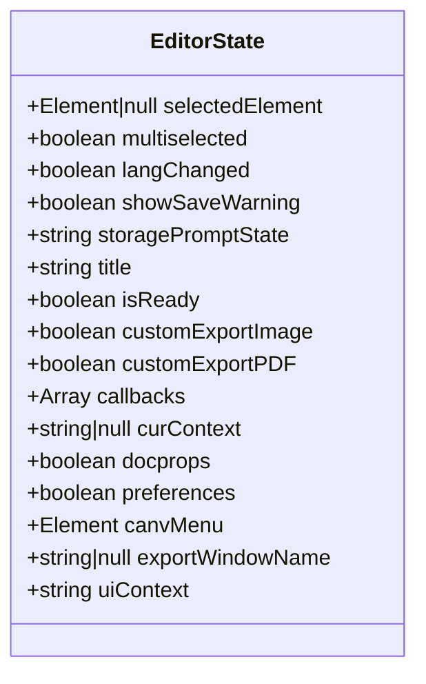

### プロパティ詳細

| プロパティ | 型 | デフォルト | 説明 |
|-----------|------|---------|------|
| `selectedElement` | Element\|null | null | 現在選択中の単一要素 |
| `multiselected` | boolean | false | 複数選択フラグ |
| `langChanged` | boolean | false | 言語変更フラグ |
| `showSaveWarning` | boolean | false | 未保存警告フラグ |
| `storagePromptState` | string | 'ignore' | ストレージ許可状態 |
| `title` | string | 'untitled.svg' | ドキュメントタイトル |
| `isReady` | boolean | false | 初期化完了フラグ |
| `uiContext` | string | 'toolbars' | UIコンテキスト |

### パネル参照

```javascript
// Editor コンストラクタで作成
this.leftPanel   = new LeftPanel(this)   // ツール選択
this.topPanel    = new TopPanel(this)    // プロパティ編集
this.bottomPanel = new BottomPanel(this) // カラー/ズーム
this.layersPanel = new LayersPanel(this) // レイヤー管理
this.mainMenu    = new MainMenu(this)    // メインメニュー
```

---

## パネル連携

### パネル構成図

```
┌──────────────────────────────────────────────────────────────────────┐
│  MainMenu (メニューバー)                                               │
│  ┌──────────────────────────────────────────────────────────────────┐ │
│  │ SVG-Edit ▼ │ Export │ Doc Properties │ Preferences │ Homepage    │ │
│  └──────────────────────────────────────────────────────────────────┘ │
├──────────┬───────────────────────────────────────────────────────────┤
│          │  TopPanel (プロパティバー)                                  │
│          │  ┌──────────────────────────────────────────────────────┐ │
│          │  │ X: [___] Y: [___] W: [___] H: [___] ∠: [___]        │ │
│          │  │ Stroke: [___] Opacity: [___] ID: [___]              │ │
│          │  └──────────────────────────────────────────────────────┘ │
│LeftPanel ├───────────────────────────────────────────────────────────┤
│          │                                                           │
│ [Select] │                     Canvas Area                           │
│ [Rect]   │                                                           │
│ [Circle] │                   ┌─────────────┐                         │
│ [Ellipse]│                   │             │                         │
│ [Line]   │                   │  SVG Content│                         │
│ [Path]   │                   │             │                         │
│ [Text]   │                   └─────────────┘                         │
│ [Image]  │                                                           │
│ [Zoom]   │                                                           │
│          │                                                           │
├──────────┴───────────────────────────────────────────────────────────┤
│  BottomPanel (ステータスバー)                                          │
│  ┌──────────────────────────────────────────────────────────────────┐ │
│  │ Fill: [■] Stroke: [□] Opacity: [___] │ Zoom: [100%] ▼          │ │
│  └──────────────────────────────────────────────────────────────────┘ │
└──────────────────────────────────────────────────────────────────────┘
                                                   ┌───────────────────┐
                                                   │ LayersPanel       │
                                                   │ ┌───────────────┐ │
                                                   │ │ Layer 2    👁 │ │
                                                   │ │ Layer 1    👁 │ │
                                                   │ └───────────────┘ │
                                                   │ [+][-][↑][↓][📋] │
                                                   └───────────────────┘
```

### パネル連携フロー

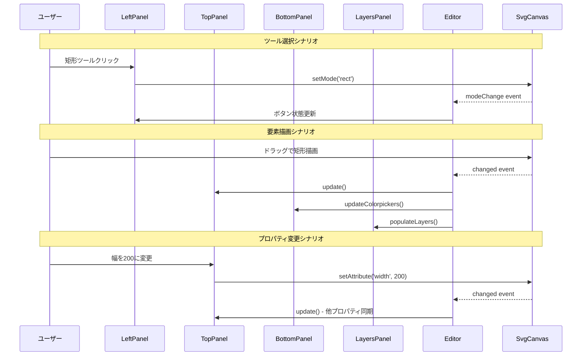

### パネル詳細

#### LeftPanel

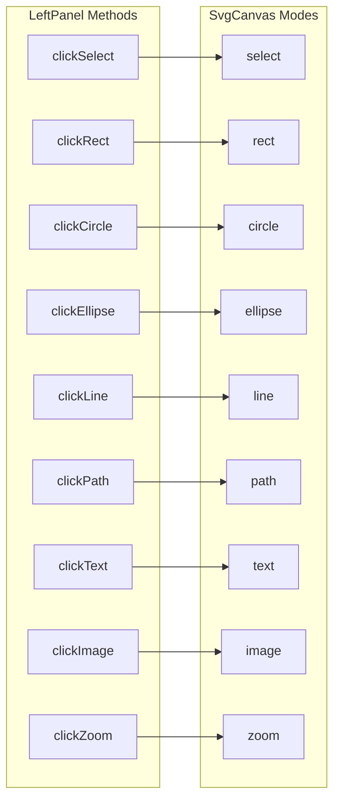

#### TopPanel

| パネルID | 表示条件 | 内容 |
|---------|---------|------|
| `xy_panel` | 要素選択時 | X, Y 座標 |
| `rect_panel` | rect 選択時 | 幅, 高さ, rx, ry |
| `circle_panel` | circle 選択時 | cx, cy, r |
| `ellipse_panel` | ellipse 選択時 | cx, cy, rx, ry |
| `line_panel` | line 選択時 | x1, y1, x2, y2 |
| `text_panel` | text 選択時 | フォント, サイズ |
| `image_panel` | image 選択時 | 画像URL |
| `g_panel` | group 選択時 | グループタイトル |
| `a_panel` | anchor 選択時 | リンクURL |

#### BottomPanel

```javascript
// 主要メソッド
updateColorpickers()    // Fill/Strokeカラー更新
updateToolButtonState() // ツールボタン有効/無効
changeZoom(val)         // ズームレベル変更
changeStrokeWidth(val)  // ストローク幅変更
```

#### LayersPanel

```javascript
// 主要メソッド
populateLayers()  // レイヤーリスト更新
newLayer()        // 新規レイヤー作成
deleteLayer()     // レイヤー削除
cloneLayer()      // レイヤー複製
moveLayer(dir)    // レイヤー順序変更
layerRename()     // レイヤー名変更
```

---

## イベントハンドラ

### SvgCanvasイベント一覧

```mermaid
graph TB
    subgraph "SvgCanvas Events"
        E1[selected]
        E2[transition]
        E3[changed]
        E4[zoomed]
        E5[zoomDone]
        E6[exported]
        E7[exportedPDF]
        E8[updateCanvas]
        E9[contextset]
        E10[extension_added]
        E11[elementRenamed]
        E12[beforeClear]
        E13[afterClear]
    end

    subgraph "Editor Handlers"
        H1[selectedChanged]
        H2[elementTransition]
        H3[elementChanged]
        H4[zoomChanged]
        H5[zoomDone]
        H6[exportHandler]
        H7[exportPDFHandler]
        H8[updateCanvasHandler]
        H9[contextChanged]
        H10[extAdded]
        H11[elementRenamed]
        H12[beforeClear]
        H13[afterClear]
    end

    E1 --> H1
    E2 --> H2
    E3 --> H3
    E4 --> H4
    E5 --> H5
    E6 --> H6
    E7 --> H7
    E8 --> H8
    E9 --> H9
    E10 --> H10
    E11 --> H11
    E12 --> H12
    E13 --> H13
```

### イベントハンドラ詳細

#### selectedChanged (選択変更)

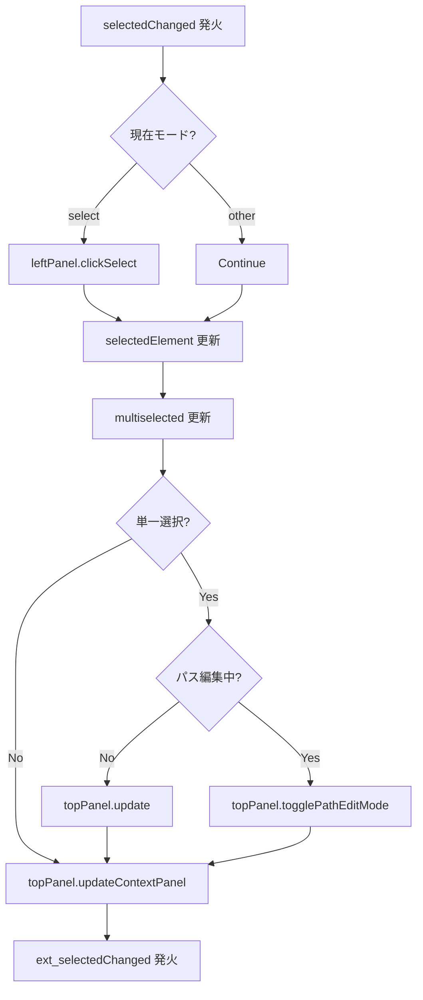

#### elementChanged (要素変更)

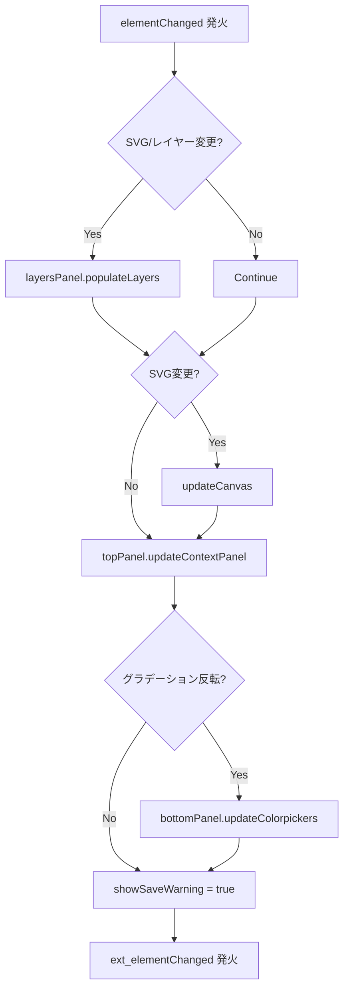

#### zoomChanged (ズーム変更)

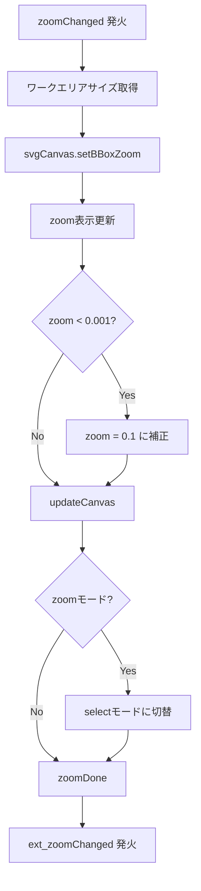

### 拡張機能イベント

```javascript
// 拡張機能に通知されるイベント
ext_selectedChanged  // 選択変更時
ext_elementChanged   // 要素変更時
ext_elementTransition // 要素変形中
ext_zoomChanged      // ズーム変更時
```

---

## キーボードショートカット

### ショートカット登録フロー

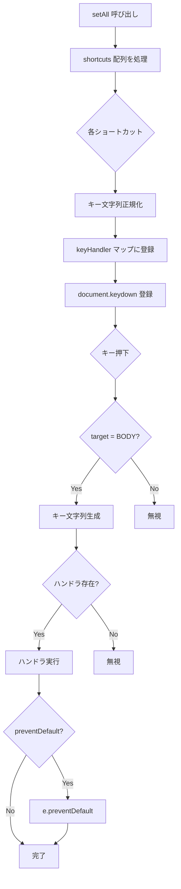

### キー文字列正規化

```javascript
// キー入力を正規化
const key = `${e.altKey ? 'alt+' : ''}` +
            `${e.shiftKey ? 'shift+' : ''}` +
            `${e.metaKey ? 'meta+' : ''}` +
            `${e.ctrlKey ? 'ctrl+' : ''}` +
            `${e.key.toLowerCase()}`

// 例: Ctrl+Shift+A → "ctrl+shift+a"
// 例: Alt+矢印左 → "alt+arrowleft"
```

### ショートカット一覧

#### 選択操作

| ショートカット | 機能 |
|--------------|------|
| `Ctrl+A` | 現在レイヤーの全選択 |
| `Tab` | 次の要素を選択 |
| `Shift+Tab` | 前の要素を選択 |
| `Shift+O` | 次の要素を選択 |
| `Shift+P` | 前の要素を選択 |
| `Escape` | ツールキャンセル/選択解除 |

#### 編集操作

| ショートカット | 機能 |
|--------------|------|
| `Ctrl+X` | 切り取り |
| `Ctrl+C` | コピー |
| `Ctrl+V` | 貼り付け |
| `Delete` / `Backspace` | 削除 |
| `Ctrl+Z` | 元に戻す |
| `Ctrl+Y` | やり直し |
| `Ctrl+G` | グループ化 |
| `Ctrl+Shift+G` | グループ解除 |

#### 移動操作

| ショートカット | 機能 |
|--------------|------|
| `↑↓←→` | 1px移動 |
| `Shift+↑↓←→` | 10px移動 |
| `Alt+↑↓←→` | 複製して1px移動 |
| `Alt+Shift+↑↓←→` | 複製して10px移動 |

#### 回転操作

| ショートカット | 機能 |
|--------------|------|
| `Ctrl+←` | 反時計回りに回転 |
| `Ctrl+→` | 時計回りに回転 |
| `Ctrl+Shift+←` | 大きく反時計回り |
| `Ctrl+Shift+→` | 大きく時計回り |

#### Zオーダー

| ショートカット | 機能 |
|--------------|------|
| `Ctrl+Shift+]` | 最前面へ |
| `Ctrl+]` | 一つ前面へ |
| `Ctrl+[` | 一つ背面へ |
| `Ctrl+Shift+[` | 最背面へ |

#### ズーム

| ショートカット | 機能 |
|--------------|------|
| `Alt+マウスホイール` | ズームイン/アウト |

---

## メニューシステム

### MainMenu 構造

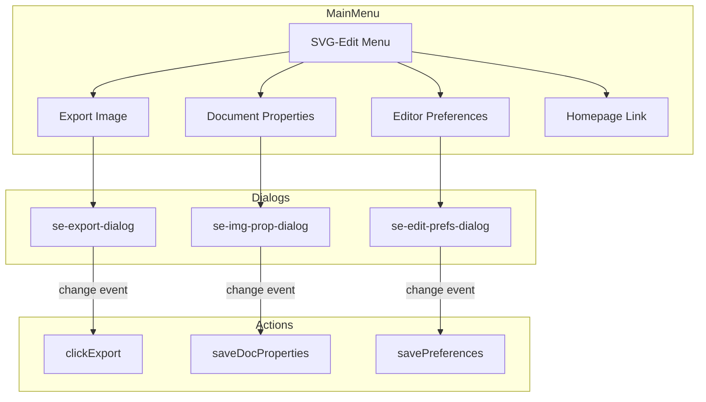

### メニュー項目

```html
<se-menu id="main_button" label="SVG-Edit">
  <se-menu-item id="tool_export"
                label="Export Image"
                shortcut="">
  </se-menu-item>

  <se-menu-item id="tool_docprops"
                label="Document Properties"
                shortcut="Shift+D">
  </se-menu-item>

  <se-menu-item id="tool_editor_prefs"
                label="Editor Preferences"
                shortcut="">
  </se-menu-item>

  <se-menu-item id="tool_editor_homepage"
                label="SVG-Edit Homepage"
                shortcut="">
  </se-menu-item>
</se-menu>
```

### エクスポートフロー

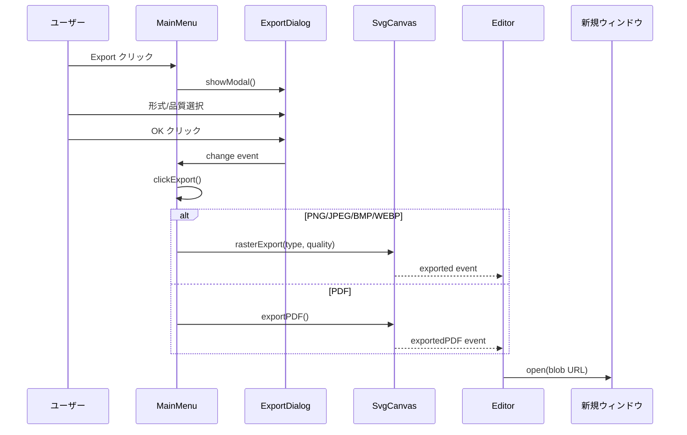

### ドキュメントプロパティ

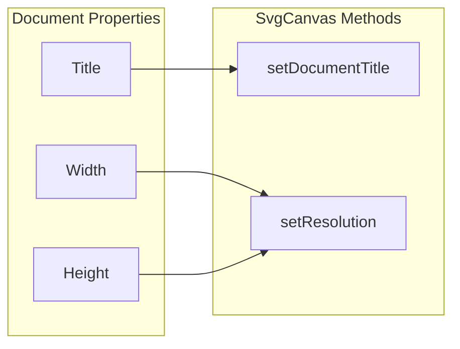

### エディタ設定

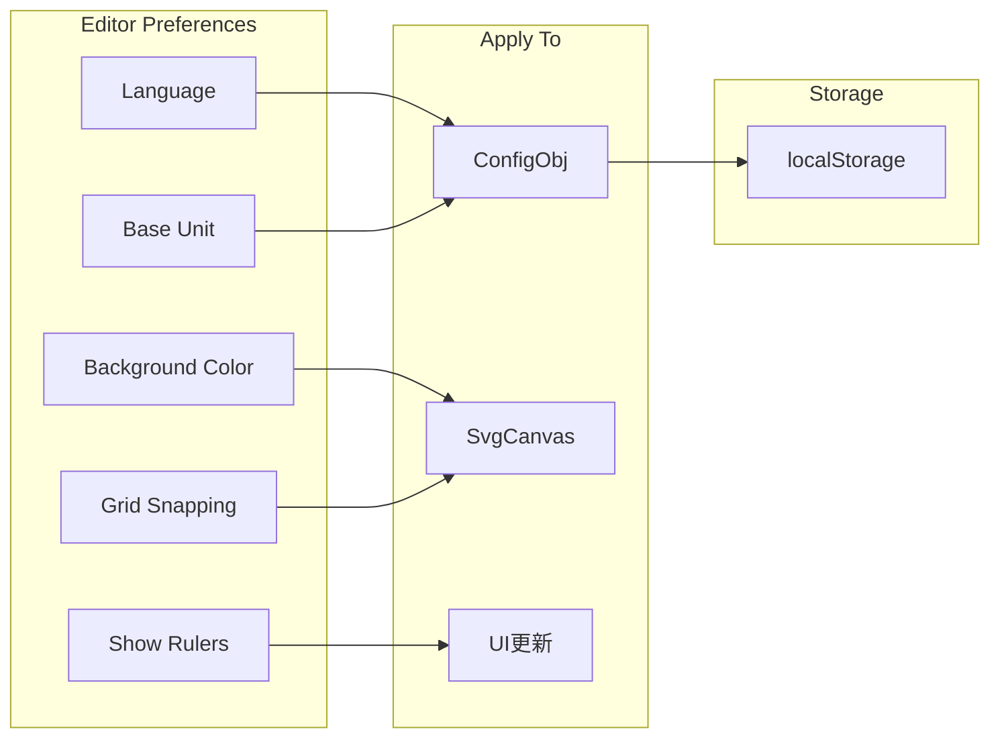

---

## 設定管理 (ConfigObj)

### 設定構造

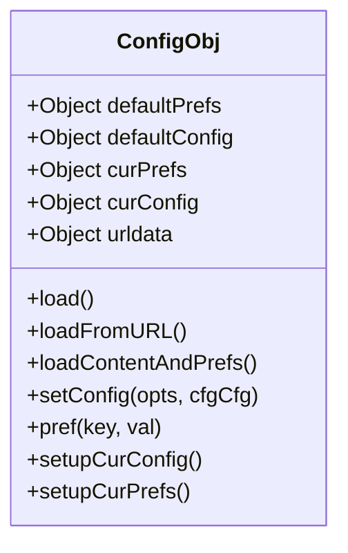

### 設定カテゴリ

```
ConfigObj
├── Preferences (ユーザー設定)
│   ├── lang          # 言語コード
│   ├── bkgd_color    # 背景色
│   ├── bkgd_url      # 背景画像URL
│   ├── img_save      # 画像保存方法
│   └── *_notice_done # 通知表示済みフラグ
│
├── Configuration (アプリ設定)
│   ├── Canvas設定
│   │   ├── canvas_expansion
│   │   ├── dimensions
│   │   └── baseUnit
│   │
│   ├── 描画設定
│   │   ├── initFill
│   │   ├── initStroke
│   │   ├── initOpacity
│   │   └── text
│   │
│   ├── ツール設定
│   │   ├── initTool
│   │   ├── wireframe
│   │   └── showlayers
│   │
│   ├── グリッド設定
│   │   ├── gridSnapping
│   │   ├── gridColor
│   │   ├── snappingStep
│   │   └── showRulers
│   │
│   ├── セキュリティ設定
│   │   ├── preventAllURLConfig
│   │   ├── preventURLContentLoading
│   │   └── lockExtensions
│   │
│   └── 拡張機能設定
│       ├── extensions
│       ├── userExtensions
│       └── allowedOrigins
│
└── URL Parameters (URLパラメータ)
    ├── source    # SVGソース
    ├── url       # SVGファイルURL
    └── 各種設定値
```

### 設定読み込みフロー

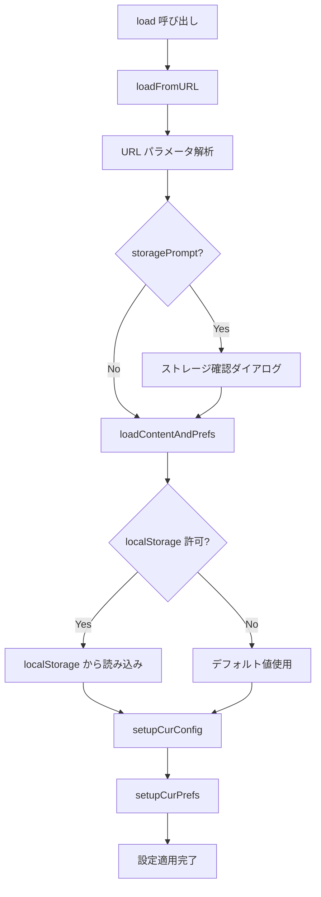

### デフォルト拡張機能

```javascript
const defaultExtensions = [
  'ext-connector',
  'ext-eyedropper',
  'ext-grid',
  'ext-markers',
  'ext-panning',
  'ext-shapes',
  'ext-polystar',
  'ext-storage',
  'ext-opensave',
  'ext-layer_view'
]
```

---

## 拡張機能管理

### 拡張機能ロードフロー

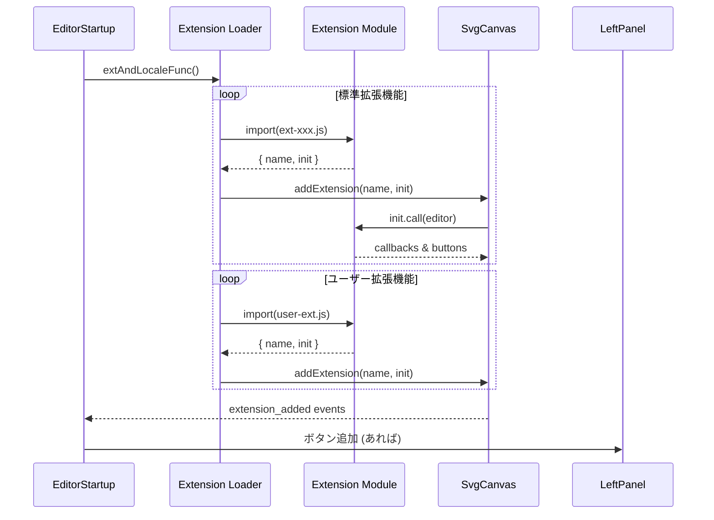

### 拡張機能インターフェース

```javascript
// 拡張機能の基本構造
export default {
  name: 'ext-example',

  async init() {
    // this = editor インスタンス
    const { svgCanvas } = this

    return {
      // UIボタン定義
      buttons: [{
        id: 'tool_example',
        icon: 'example.svg',
        type: 'mode',  // or 'context'
        panel: 'editor_panel',
        events: {
          click() {
            svgCanvas.setMode('example')
          }
        }
      }],

      // コンテキストツール
      context_tools: [{
        type: 'input',
        panel: 'example_panel',
        id: 'example_input'
      }],

      // イベントコールバック
      callback() {
        // 初期化後に呼ばれる
      },

      selectedChanged(opts) {
        // 選択変更時
      },

      elementChanged(opts) {
        // 要素変更時
      },

      mouseDown(opts) {
        // マウスダウン時
      },

      mouseMove(opts) {
        // マウス移動時
      },

      mouseUp(opts) {
        // マウスアップ時
      }
    }
  }
}
```

### 拡張機能ライフサイクル

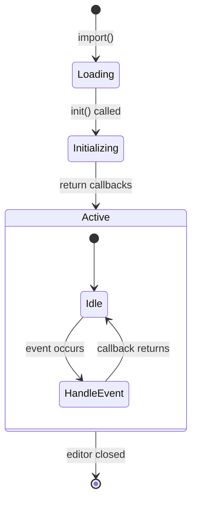

### 標準拡張機能

| 拡張機能 | 機能 |
|---------|------|
| `ext-grid` | グリッド表示とスナップ |
| `ext-storage` | LocalStorage自動保存 |
| `ext-opensave` | ファイル開く/保存ダイアログ |
| `ext-panning` | パンツール |
| `ext-shapes` | 定義済み図形ライブラリ |
| `ext-markers` | SVGマーカー |
| `ext-polystar` | 多角形/星形ツール |
| `ext-connector` | コネクタ線 |
| `ext-eyedropper` | スポイトツール |
| `ext-layer_view` | レイヤービュー |

---

## インポート/エクスポート

### インポート方法

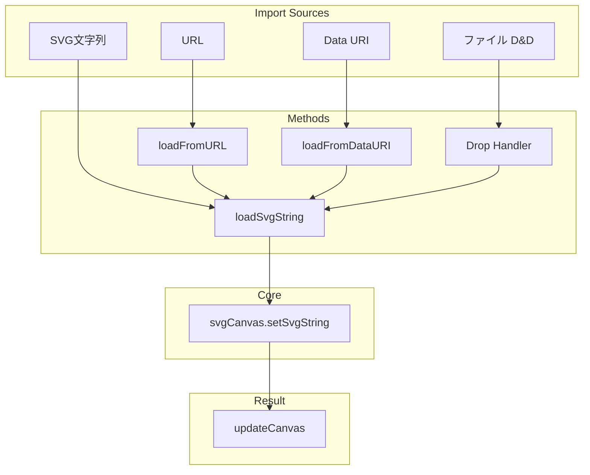

### インポートメソッド詳細

```javascript
// SVG文字列から読み込み
loadSvgString(str, { noAlert } = {}) {
  const success = this.svgCanvas.setSvgString(str) !== false
  if (success) {
    this.updateCanvas()
  }
}

// URLから読み込み
async loadFromURL(url, opts = {}) {
  const response = await fetch(url, { cache: opts.cache })
  const svgContent = await response.text()
  this.loadSvgString(svgContent)
}

// Data URIから読み込み
loadFromDataURI(str) {
  // base64 または URL encoded をデコード
  const base64 = str.includes('base64')
  const content = base64 ? atob(data) : decodeURIComponent(data)
  this.loadSvgString(content)
}
```

### エクスポート形式

```mermaid
flowchart LR
    subgraph "Export Formats"
        PNG[PNG]
        JPEG[JPEG]
        BMP[BMP]
        WEBP[WEBP]
        PDF[PDF]
        SVG[SVG]
    end

    subgraph "Methods"
        R[rasterExport]
        P[exportPDF]
        S[getSvgString]
    end

    PNG --> R
    JPEG --> R
    BMP --> R
    WEBP --> R
    PDF --> P
    SVG --> S
```

### エクスポートシーケンス

```mermaid
sequenceDiagram
    participant User as ユーザー
    participant Dialog as ExportDialog
    participant Editor as Editor
    participant Canvas as SvgCanvas
    participant Browser as ブラウザ

    User->>Dialog: エクスポート設定
    Dialog->>Editor: 形式: PNG, 品質: 100

    Editor->>Browser: window.open('', exportWindowName)
    Note over Browser: プレースホルダーウィンドウ

    Editor->>Canvas: rasterExport('PNG', 100)
    Canvas->>Canvas: SVG → Canvas → Blob

    Canvas-->>Editor: exported event (blob)

    Editor->>Browser: location = blob URL
    Note over Browser: 画像表示

    opt 初回エクスポート
        Editor->>User: 保存方法の説明表示
    end
```

---

## 状態管理

### 状態図

```mermaid
stateDiagram-v2
    [*] --> NotReady: new Editor()

    NotReady --> Initializing: init()

    state Initializing {
        [*] --> LoadingConfig
        LoadingConfig --> BuildingDOM
        BuildingDOM --> CreatingCanvas
        CreatingCanvas --> InitializingPanels
        InitializingPanels --> LoadingExtensions
        LoadingExtensions --> [*]
    }

    Initializing --> Ready: isReady = true

    state Ready {
        [*] --> Idle

        Idle --> Editing: 要素選択/編集
        Editing --> Idle: 選択解除

        Idle --> Drawing: ツール選択
        Drawing --> Idle: 描画完了

        Editing --> Modified: 変更実行
        Modified --> Editing: 継続編集
    }

    Ready --> [*]: close
```

### 選択状態

```mermaid
stateDiagram-v2
    [*] --> NoSelection

    NoSelection --> SingleSelection: click element
    NoSelection --> MultiSelection: shift+click / drag select

    SingleSelection --> NoSelection: click empty
    SingleSelection --> MultiSelection: shift+click another
    SingleSelection --> SingleSelection: click different

    MultiSelection --> NoSelection: click empty
    MultiSelection --> SingleSelection: click single
    MultiSelection --> MultiSelection: shift+click

    state SingleSelection {
        selectedElement = element
        multiselected = false
    }

    state MultiSelection {
        selectedElement = null
        multiselected = true
    }

    state NoSelection {
        selectedElement = null
        multiselected = false
    }
```

### 保存状態

```mermaid
flowchart TD
    A[初期状態] --> B{変更あり?}
    B -->|No| C[showSaveWarning = false]
    B -->|Yes| D[showSaveWarning = true]

    D --> E{ページ離脱?}
    E -->|Yes| F[警告ダイアログ表示]
    E -->|No| G{保存実行?}

    G -->|Yes| H[showSaveWarning = false]
    G -->|No| D

    F --> I{続行?}
    I -->|Yes| J[ページ離脱]
    I -->|No| D
```

---

## SvgCanvas API連携

### API カテゴリ

```mermaid
mindmap
  root((SvgCanvas API))
    Document
      setSvgString
      getSvgString
      setDocumentTitle
      getDocumentTitle
      setResolution
      getResolution
    Selection
      selectAllInCurrentLayer
      clearSelection
      getSelectedElements
      cycleElement
      deleteSelectedElements
    Transform
      moveSelectedElements
      setRotationAngle
      getRotationAngle
    Style
      setStrokeWidth
      setStrokeAttr
      setOpacity
      setColor
      getColor
    Layer
      getCurrentDrawing
      createLayer
      deleteCurrentLayer
      renameCurrentLayer
      moveSelectedToLayer
    Group
      groupSelectedElements
      ungroupSelectedElement
      setContext
      leaveContext
    Clipboard
      copySelectedElements
      cutSelectedElements
      pasteElements
      cloneSelectedElements
    Mode
      setMode
      getMode
    Zoom
      setCurrentZoom
      getZoom
      setBBoxZoom
    Event
      bind
      call
      runExtensions
      addExtension
```

### よく使用されるAPI呼び出し

#### ツール操作

```javascript
// モード切替
svgCanvas.setMode('select')
svgCanvas.setMode('rect')
svgCanvas.setMode('path')

// 現在モード取得
const mode = svgCanvas.getMode()
```

#### 選択操作

```javascript
// 全選択
svgCanvas.selectAllInCurrentLayer()

// 選択解除
svgCanvas.clearSelection()

// 選択要素取得
const elems = svgCanvas.getSelectedElements()

// 要素巡回
svgCanvas.cycleElement(1)  // 次へ
svgCanvas.cycleElement(-1) // 前へ

// 削除
svgCanvas.deleteSelectedElements()
```

#### スタイル操作

```javascript
// 色設定
svgCanvas.setColor('fill', '#ff0000')
svgCanvas.setColor('stroke', '#000000')

// ストローク
svgCanvas.setStrokeWidth(2)
svgCanvas.setStrokeAttr('linecap', 'round')

// 透明度
svgCanvas.setOpacity(0.5)
```

#### 変形操作

```javascript
// 移動
svgCanvas.moveSelectedElements(10, 0)  // 右に10px

// 回転
svgCanvas.setRotationAngle(45)
const angle = svgCanvas.getRotationAngle(elem)

// 複製
svgCanvas.cloneSelectedElements(10, 10)
```

#### レイヤー操作

```javascript
const drawing = svgCanvas.getCurrentDrawing()

// レイヤー作成/削除
svgCanvas.createLayer('New Layer')
svgCanvas.deleteCurrentLayer()

// レイヤー名変更
svgCanvas.renameCurrentLayer('Renamed')

// 要素をレイヤーに移動
svgCanvas.moveSelectedToLayer('Layer 1')
```

### イベントバインディング

```javascript
// イベント購読
svgCanvas.bind('selected', (win, elems) => {
  console.log('Selected:', elems)
})

svgCanvas.bind('changed', (win, elems) => {
  console.log('Changed:', elems)
})

svgCanvas.bind('zoomed', (win, zoom) => {
  console.log('Zoom:', zoom)
})

// 拡張機能実行
svgCanvas.runExtensions('selectedChanged', {
  elems,
  selectedElement,
  multiselected
})
```

---

## まとめ

### Editorの主要責務

1. **初期化**: DOM構築、Canvas作成、パネル初期化、拡張機能ロード
2. **イベントハブ**: SvgCanvasイベントを受け取り、各パネルに配信
3. **状態管理**: 選択状態、保存状態、UI状態の管理
4. **ショートカット**: キーボード入力のハンドリング
5. **拡張性**: 拡張機能のロードと管理

### 設計の特徴

- **疎結合**: イベント駆動でコンポーネント間を連携
- **拡張可能**: プラグインシステムで機能追加が容易
- **設定可能**: ConfigObjによる柔軟な設定管理
- **モジュラー**: 機能ごとにファイル分割
