# SVG-Edit SvgCanvas アーキテクチャ詳細

このドキュメントはSVG-EditのSvgCanvasコンポーネント（`packages/svgcanvas/`）を詳細に解説します。

## 目次

1. [概要](#概要)
2. [ファイル構成](#ファイル構成)
3. [クラス構造](#クラス構造)
4. [初期化シーケンス](#初期化シーケンス)
5. [コアモジュール詳細](#コアモジュール詳細)
6. [イベントシステム](#イベントシステム)
7. [描画とレイヤー管理](#描画とレイヤー管理)
8. [選択システム](#選択システム)
9. [パス編集システム](#パス編集システム)
10. [Undo/Redoシステム](#undoredoシステム)
11. [座標変換システム](#座標変換システム)
12. [マウス/キーボードイベント](#マウスキーボードイベント)
13. [要素操作API](#要素操作api)
14. [モジュール間連携](#モジュール間連携)
15. [データフロー](#データフロー)

---

## 概要

SvgCanvasはSVG-Editの描画エンジンのコア部分です。独立したnpmパッケージ（`@svgedit/svgcanvas`）として公開されており、他のプロジェクトでも利用可能です。

### 主な責務

```
┌─────────────────────────────────────────────────────────────────┐
│                        SvgCanvas                                 │
├─────────────────────────────────────────────────────────────────┤
│  - SVG要素の作成・編集・削除                                      │
│  - 選択・変形・移動操作                                           │
│  - パス編集（ベジエ曲線、制御点）                                   │
│  - レイヤー管理                                                   │
│  - Undo/Redo履歴管理                                             │
│  - 座標変換・ズーム                                               │
│  - イベントハンドリング                                           │
│  - SVGインポート/エクスポート                                     │
└─────────────────────────────────────────────────────────────────┘
```

### アーキテクチャ特徴

- **モジュラー設計**: 20以上のコアモジュールで構成
- **ファサードパターン**: SvgCanvasが全モジュールを統括
- **コマンドパターン**: Undo/Redoを一貫して実現
- **イベント駆動**: bind/callメカニズムで疎結合

---

## ファイル構成

```
packages/svgcanvas/
├── svgcanvas.js           # メインクラス (47KB)
├── core/
│   ├── 描画系
│   │   ├── draw.js        # 描画・レイヤー管理 (34KB)
│   │   └── layer.js       # レイヤークラス (6.4KB)
│   │
│   ├── 選択系
│   │   ├── select.js      # セレクターUI (17KB)
│   │   └── selection.js   # 選択操作 (15KB)
│   │
│   ├── パス系
│   │   ├── path.js        # パス編集エントリ (22KB)
│   │   ├── path-method.js # セグメント操作 (25KB)
│   │   └── path-actions.js# パス編集アクション (36KB)
│   │
│   ├── 履歴系
│   │   ├── history.js     # コマンドパターン (17KB)
│   │   ├── undo.js        # UndoManager初期化 (10KB)
│   │   └── historyrecording.js # バッチ操作 (6.2KB)
│   │
│   ├── 座標系
│   │   ├── coords.js      # 座標変換 (11KB)
│   │   ├── math.js        # 行列演算 (7.1KB)
│   │   ├── recalculate.js # 寸法再計算 (14KB)
│   │   └── units.js       # 単位変換 (7.2KB)
│   │
│   ├── イベント系
│   │   ├── event.js       # マウス/キーボード (47KB)
│   │   └── touch.js       # タッチ入力 (1.4KB)
│   │
│   ├── 要素操作系
│   │   ├── elem-get-set.js    # 属性get/set (35KB)
│   │   ├── selected-elem.js   # 選択要素操作 (41KB)
│   │   └── text-actions.js    # テキスト編集 (13KB)
│   │
│   ├── SVG操作系
│   │   ├── svg-exec.js    # SVG実行 (40KB)
│   │   ├── utilities.js   # ユーティリティ (45KB)
│   │   ├── sanitize.js    # サニタイズ (17KB)
│   │   └── json.js        # JSON変換 (2.9KB)
│   │
│   └── その他
│       ├── blur-event.js  # ブラーフィルタ (4.3KB)
│       ├── paste-elem.js  # ペースト (3.4KB)
│       ├── clear.js       # クリア (1.3KB)
│       ├── copy-elem.js   # コピー (1.3KB)
│       ├── paint.js       # ペイント (2.8KB)
│       ├── dataStorage.js # データストレージ (949B)
│       ├── namespaces.js  # 名前空間 (1.2KB)
│       └── svg-root.js    # SVGルート (1.2KB)
│
└── common/                # 共有ユーティリティ
```

---

## クラス構造

### SvgCanvasクラス概要

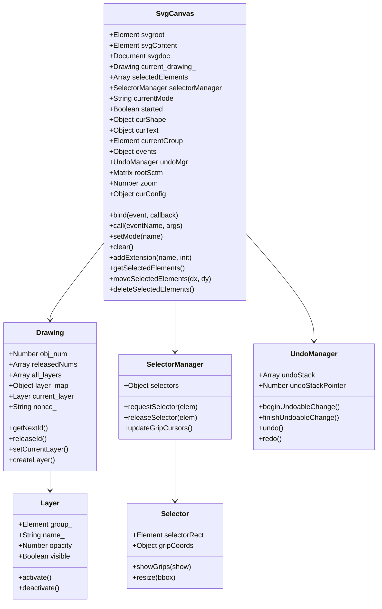

### プロパティ詳細

| カテゴリ | プロパティ | 型 | 説明 |
|---------|-----------|------|------|
| **レンダリング** | `svgroot` | Element | SVGコンテナ要素 |
| | `svgContent` | Element | 描画用SVG要素 |
| | `svgdoc` | Document | SVGドキュメント |
| **描画管理** | `current_drawing_` | Drawing | ID管理用Drawingオブジェクト |
| | `idprefix` | String | ID接頭辞 (デフォルト: "svg_") |
| **選択** | `selectedElements` | Array | 選択中の要素配列 |
| | `selectorManager` | SelectorManager | セレクターUI管理 |
| **状態** | `currentMode` | String | 現在の編集モード |
| | `started` | Boolean | 操作進行中フラグ |
| **スタイル** | `curShape` | Object | 現在の図形スタイル |
| | `curText` | Object | 現在のテキストスタイル |
| **レイヤー** | `currentGroup` | Element | グループ内編集用 |
| **イベント** | `events` | Object | イベントハンドラ |
| **履歴** | `undoMgr` | UndoManager | Undo/Redo管理 |
| **変換** | `rootSctm` | Matrix | ルート変換行列 |
| | `zoom` | Number | ズームレベル |
| **設定** | `curConfig` | Object | 設定オブジェクト |

---

## 初期化シーケンス

### モジュール初期化順序

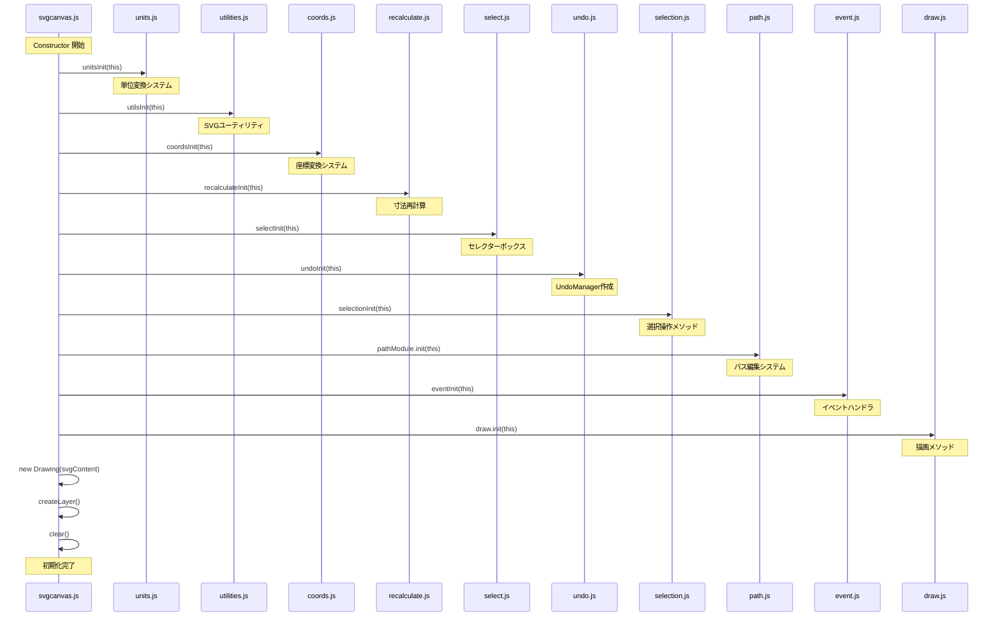

### 初期化コード概要

```javascript
constructor(container, config) {
  // Step 1: SVGルート要素作成
  this.svgroot = svgRootElement(document, config.dimensions)
  container.append(this.svgroot)
  this.svgContent = document.createElementNS(NS.SVG, 'svg')

  // Step 2: コアモジュール初期化（順序重要）
  unitsInit(this)           // 単位変換
  utilsInit(this)           // ユーティリティ
  coordsInit(this)          // 座標システム
  recalculateInit(this)     // 寸法計算
  selectInit(this)          // 選択ボックス
  undoInit(this)            // Undo管理
  selectionInit(this)       // 選択操作
  jsonInit(this)            // JSON変換
  pathModule.init(this)     // パス編集

  // Step 3: イベント・UI初期化
  eventInit(this)           // マウス/キーボード
  textActionsInit(this)     // テキスト編集
  svgInit(this)             // SVG操作
  draw.init(this)           // 描画操作
  elemGetSet.init(this)     // 要素アクセス

  // Step 4: 最終初期化
  blurInit(this)            // ブラーエフェクト
  selectedElemInit(this)    // 選択要素操作
  pasteInit(this)           // クリップボード

  // Step 5: 描画システム作成
  this.current_drawing_ = new draw.Drawing(this.svgContent)
  this.createLayer()        // デフォルトレイヤー
  this.clear()              // 初期状態にリセット
}
```

---

## コアモジュール詳細

### モジュール分類図

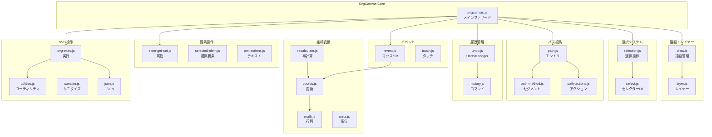

### 各モジュールの責務

| モジュール | サイズ | 主な責務 |
|-----------|--------|---------|
| `svgcanvas.js` | 47KB | ファサード、モジュール統合 |
| `event.js` | 47KB | マウス・キーボードイベント処理 |
| `utilities.js` | 45KB | SVG操作ユーティリティ |
| `selected-elem.js` | 41KB | 選択要素への操作 |
| `svg-exec.js` | 40KB | SVGインポート/エクスポート |
| `path-actions.js` | 36KB | パス編集アクション |
| `elem-get-set.js` | 35KB | 要素属性のget/set |
| `draw.js` | 34KB | 描画・レイヤー管理 |
| `path-method.js` | 25KB | パスセグメント操作 |
| `path.js` | 22KB | パス編集インターフェース |
| `sanitize.js` | 17KB | SVGセキュリティ |
| `history.js` | 17KB | コマンドパターン実装 |
| `select.js` | 17KB | セレクターUI |
| `selection.js` | 15KB | 選択操作 |
| `recalculate.js` | 14KB | 変形後の寸法再計算 |
| `text-actions.js` | 13KB | テキスト編集 |
| `coords.js` | 11KB | 座標リマッピング |
| `undo.js` | 10KB | UndoManager初期化 |
| `math.js` | 7.1KB | 行列演算 |
| `units.js` | 7.2KB | 単位変換 |
| `layer.js` | 6.4KB | レイヤークラス |

---

## イベントシステム

### bind/callメカニズム

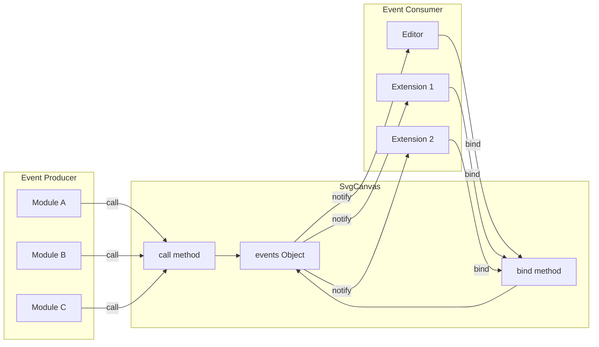

### イベント登録と発火

```javascript
// イベントシステム実装
class SvgCanvas {
  events = {}

  // イベント購読
  bind(eventName, callback) {
    const old = this.events[eventName]
    this.events[eventName] = callback
    return old  // 前のハンドラを返す
  }

  // イベント発火
  call(eventName, arg) {
    if (this.events[eventName]) {
      return this.events[eventName](window, arg)
    }
    return undefined
  }
}
```

### イベント一覧

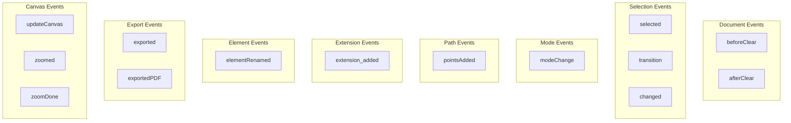

| イベント | 発火タイミング | 引数 |
|---------|--------------|------|
| `beforeClear` | ドキュメントクリア前 | - |
| `afterClear` | ドキュメントクリア後 | - |
| `selected` | 選択変更時 | 選択要素配列 |
| `transition` | 変形アニメーション中 | 変形中要素 |
| `changed` | 要素属性変更後 | 変更要素配列 |
| `modeChange` | 編集モード変更時 | 新モード名 |
| `pointsAdded` | パスポイント追加時 | ポイント情報 |
| `extension_added` | 拡張機能追加時 | 拡張機能情報 |
| `elementRenamed` | 要素ID変更時 | 旧/新ID |
| `exported` | 画像エクスポート完了 | Blobデータ |
| `zoomed` | ズーム変更時 | ズームレベル |

---

## 描画とレイヤー管理

### レイヤー階層構造

```
SvgCanvas
├── svgContent (SVG要素)
│   ├── <defs>
│   │   ├── グラデーション定義
│   │   ├── パターン定義
│   │   └── フィルター定義
│   │
│   └── current_drawing_ (Drawing)
│       ├── all_layers[] (レイヤー配列)
│       │   ├── Layer 1
│       │   │   └── <g class="layer"> (group_)
│       │   │       ├── <title>Layer 1</title>
│       │   │       ├── <rect id="svg_1">
│       │   │       ├── <circle id="svg_2">
│       │   │       └── ...
│       │   │
│       │   ├── Layer 2
│       │   │   └── <g class="layer">
│       │   │       └── ...
│       │   │
│       │   └── Layer N
│       │
│       ├── layer_map{} (名前→レイヤー)
│       ├── current_layer (アクティブレイヤー)
│       ├── obj_num (ID連番)
│       └── nonce_ (一意性トークン)
│
└── selectorParentGroup
    └── 選択ボックス・グリップ
```

### Drawingクラス

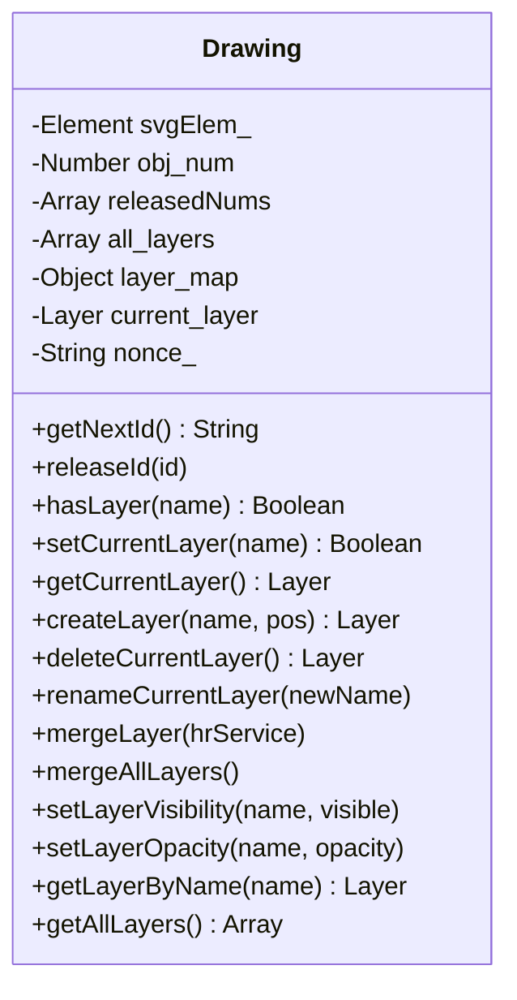

### レイヤー操作フロー

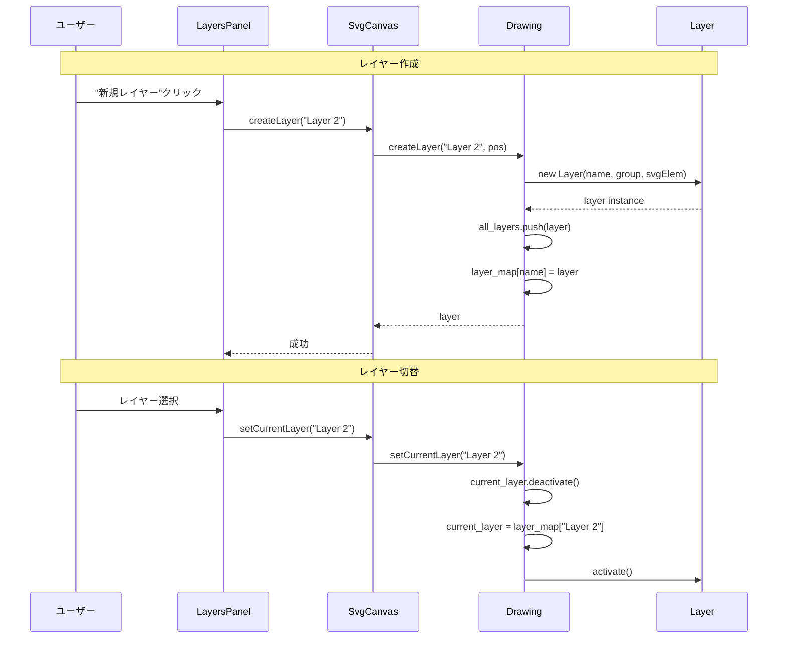

### ID管理

```javascript
// IDの発行と再利用
class Drawing {
  obj_num = 1
  releasedNums = []

  getNextId() {
    // 再利用可能なIDがあれば使用
    if (this.releasedNums.length > 0) {
      return this.idprefix + this.releasedNums.pop()
    }
    // 新しいIDを発行
    return this.idprefix + this.obj_num++
  }

  releaseId(id) {
    // 削除された要素のIDを再利用リストに追加
    const num = parseInt(id.replace(this.idprefix, ''))
    if (!isNaN(num)) {
      this.releasedNums.push(num)
    }
  }
}
```

---

## 選択システム

### 選択システム構成

```mermaid
graph TB
    subgraph "Selection System"
        SM[SelectorManager<br/>セレクター管理]
        S1[Selector 1]
        S2[Selector 2]
        S3[Selector Pool...]
    end

    subgraph "Visual Elements"
        SR[selectorRect<br/>選択枠]
        GR[Grips<br/>リサイズハンドル]
        RC[rotateConnector<br/>回転線]
        RG[rotateGrip<br/>回転ハンドル]
    end

    subgraph "Selection State"
        SE[selectedElements[]]
    end

    SM --> S1
    SM --> S2
    SM --> S3

    S1 --> SR
    S1 --> GR
    S1 --> RC
    S1 --> RG

    SE --> SM
```

### Selectorクラス

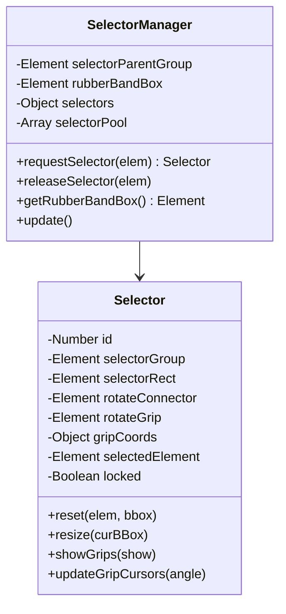

### グリップ位置

```
     nw ───── n ───── ne
      │               │
      │               │
      w       ●       e
      │    (center)   │
      │               │
     sw ───── s ───── se

           ↑
      rotateGrip
           │
    rotateConnector
```

### 選択フロー

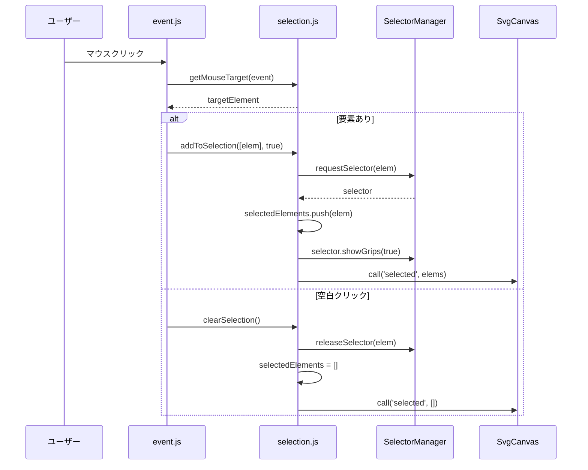

### 選択操作メソッド

| メソッド | 説明 |
|---------|------|
| `clearSelection(noCall)` | 全選択解除 |
| `addToSelection(elems, showGrips)` | 選択に追加 |
| `removeFromSelection(elems)` | 選択から削除 |
| `getMouseTarget(event)` | クリック対象取得 |
| `getIntersectionList(bbox)` | 範囲選択 |
| `selectAllInCurrentLayer()` | 全選択 |
| `cycleElement(dir)` | 要素巡回 |

---

## パス編集システム

### パス編集構成

```mermaid
graph TB
    subgraph "Path Editing System"
        PI[path.js<br/>インターフェース]
        PM[path-method.js<br/>Pathクラス]
        PA[path-actions.js<br/>アクション]
    end

    subgraph "Path State"
        CP[currentPath]
        PD[pathData{}]
        Seg[segments[]]
    end

    subgraph "Visual Elements"
        Grips[pointGrips<br/>制御点]
        Segs[segSelectors<br/>セグメント選択]
        Ctrl[ctrlPts<br/>ベジエ制御点]
    end

    PI --> PM
    PI --> PA
    PM --> CP
    PM --> PD
    PM --> Seg
    PA --> Grips
    PA --> Segs
    PA --> Ctrl
```

### パスセグメントタイプ

```
M (moveto)      - 移動
L (lineto)      - 直線
H (horizontal)  - 水平線
V (vertical)    - 垂直線
C (curveto)     - 3次ベジエ曲線
S (smooth)      - スムーズ曲線
Q (quadratic)   - 2次ベジエ曲線
T (smooth quad) - スムーズ2次曲線
A (arc)         - 楕円弧
Z (closepath)   - パス閉じる
```

### Pathクラス

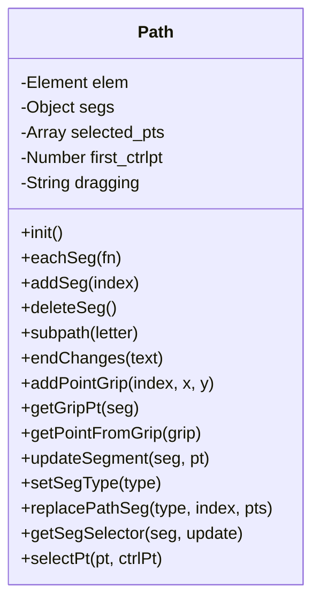

### パス編集モード

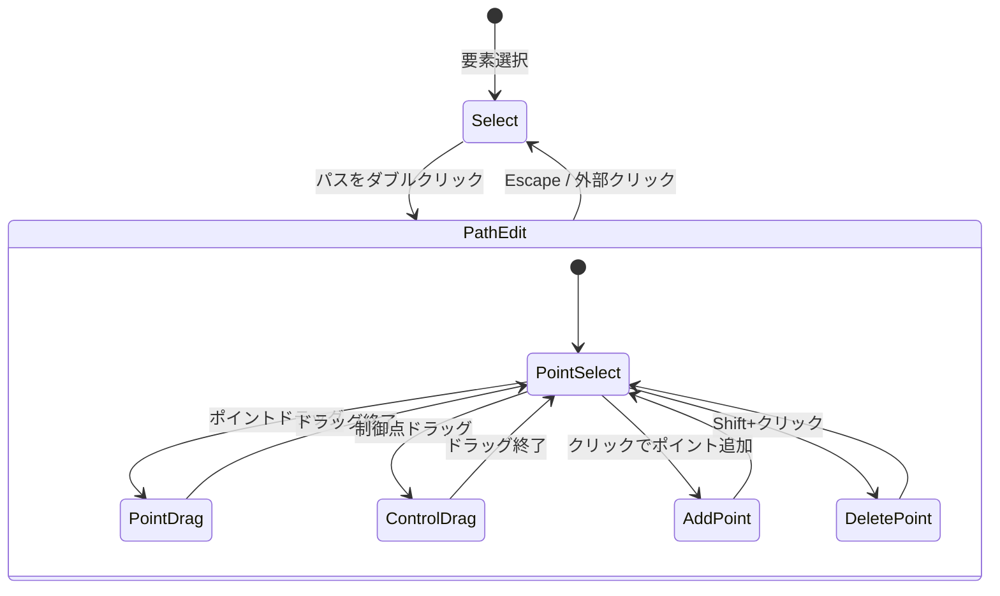

### パス編集シーケンス

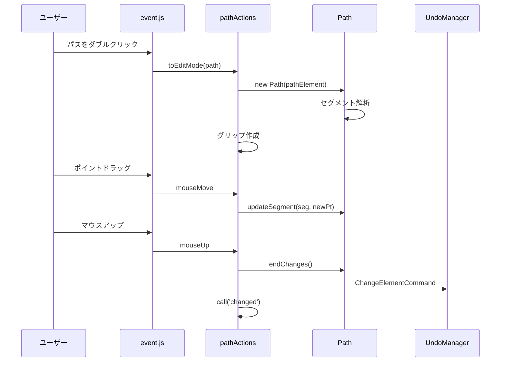

---

## Undo/Redoシステム

### コマンドパターン構造

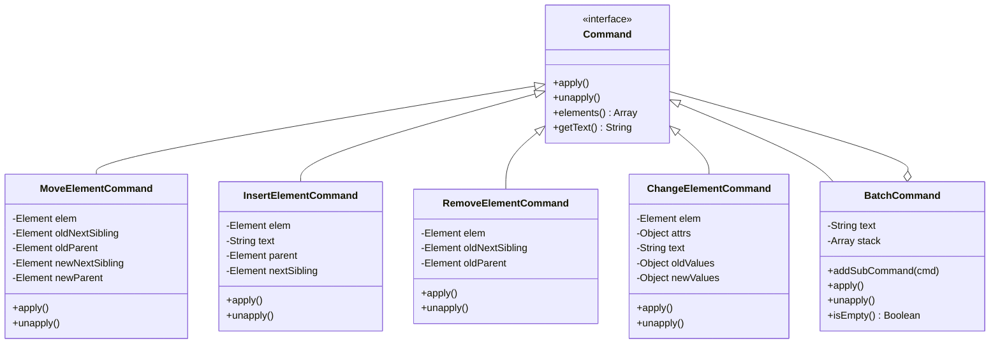

### UndoManager

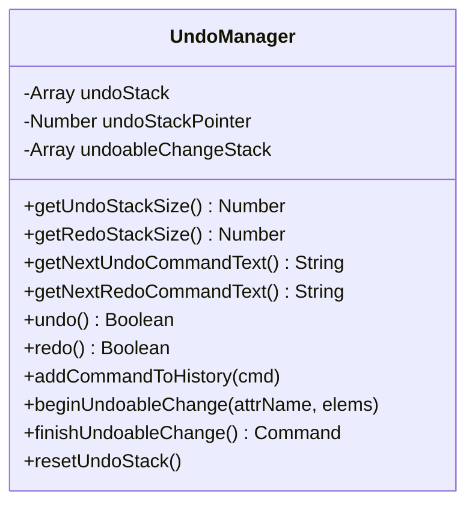

### Undo/Redoフロー

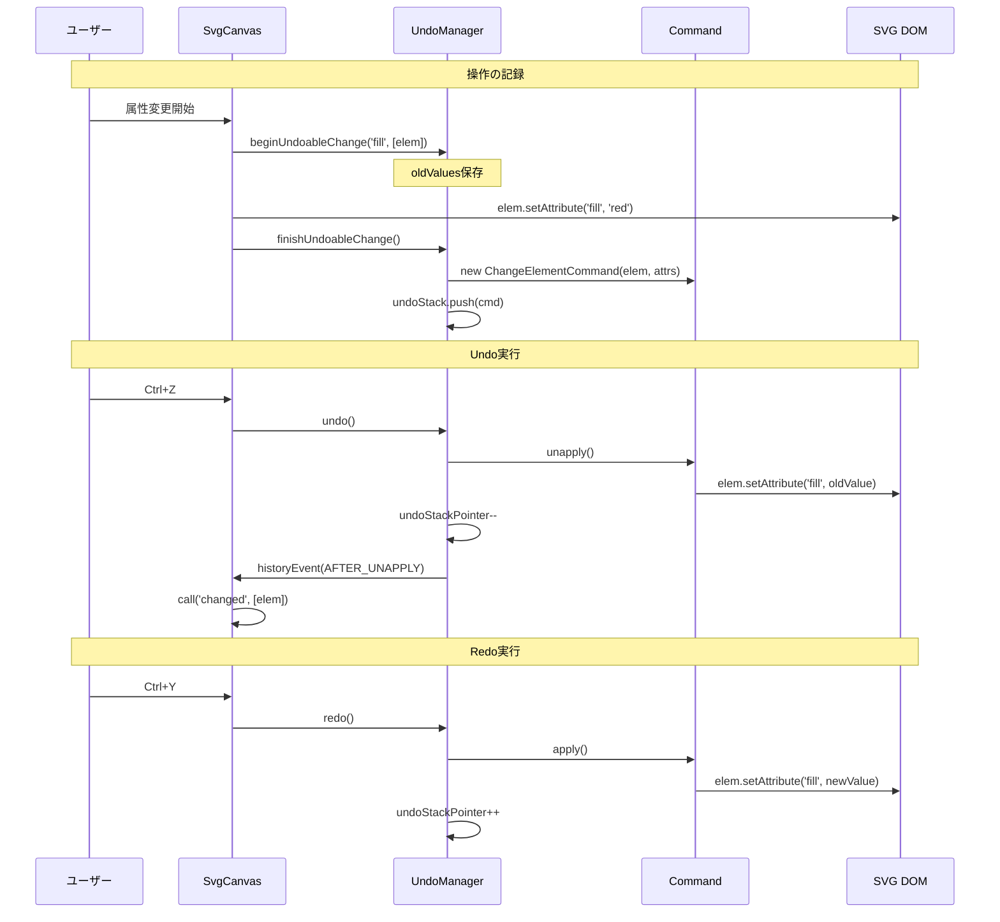

### コマンドスタック状態

```
undoStack: [Cmd1, Cmd2, Cmd3, Cmd4, Cmd5]
                              ↑
                    undoStackPointer = 4

Undo可能: Cmd4, Cmd3, Cmd2, Cmd1
Redo可能: Cmd5

Undo実行後:
undoStack: [Cmd1, Cmd2, Cmd3, Cmd4, Cmd5]
                        ↑
              undoStackPointer = 3

新しい操作を追加すると:
undoStack: [Cmd1, Cmd2, Cmd3, NewCmd]
                              ↑
              undoStackPointer = 4
(Cmd4, Cmd5は破棄)
```

---

## 座標変換システム

### 座標空間

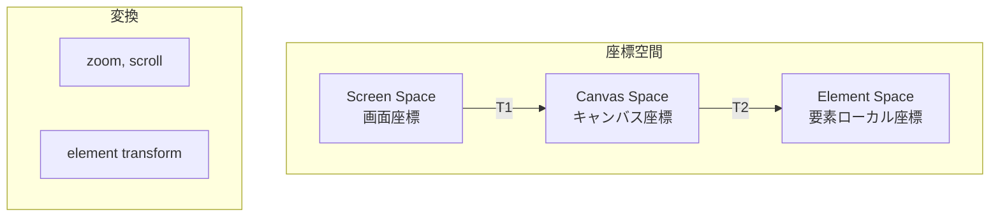

### 変換モジュール連携

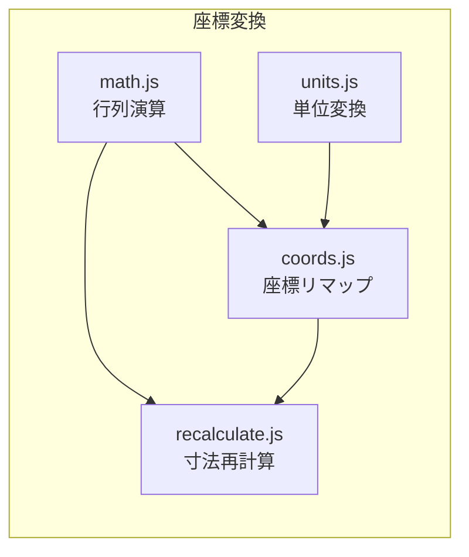

### math.js 主要関数

```javascript
// 行列をポイントに適用
transformPoint(x, y, matrix)

// 要素の変換リスト取得
getTransformList(elem)

// 単位行列か判定
isIdentity(matrix)

// 行列の乗算
matrixMultiply(...matrices)

// 変換行列を持つか判定
hasMatrixTransform(tlist)

// バウンディングボックスを変換
transformBox(l, t, w, h, matrix)

// 変換リストを単一行列に
transformListToTransform(tlist)

// 角度スナップ
snapToAngle(angle, snap_tol)

// 矩形の交差判定
rectsIntersect(r1, r2)
```

### 変形後の再計算

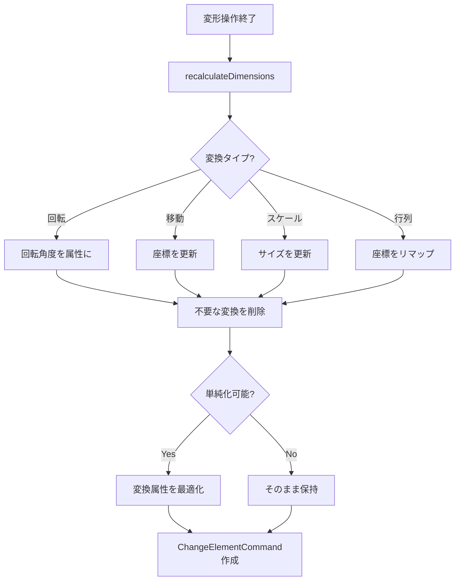

---

## マウス/キーボードイベント

### イベントハンドラ構成

```mermaid
graph TB
    subgraph "event.js"
        MD[mouseDownEvent]
        MM[mouseMoveEvent]
        MU[mouseUpEvent]
        DC[dblClickEvent]
        MO[mouseOutEvent]
        WH[DOMMouseScrollEvent]
    end

    subgraph "Processing"
        GMT[getMouseTarget]
        MODE[Mode Dispatch]
        SNAP[Grid Snap]
        CMD[Command Creation]
    end

    MD --> GMT
    MD --> MODE
    MM --> SNAP
    MM --> MODE
    MU --> CMD
```

### モード別処理

```mermaid
flowchart TD
    A[mouseDown] --> B{currentMode?}

    B -->|select| C[選択/ドラッグ開始]
    B -->|rect| D[矩形描画開始]
    B -->|circle| E[円描画開始]
    B -->|ellipse| F[楕円描画開始]
    B -->|line| G[線描画開始]
    B -->|path| H[パス描画開始]
    B -->|text| I[テキスト入力]
    B -->|image| J[画像配置]
    B -->|zoom| K[ズーム操作]
    B -->|pathedit| L[パス編集]

    C --> M[要素検出]
    M --> N{要素あり?}
    N -->|Yes| O[選択/変形準備]
    N -->|No| P[範囲選択開始]
```

### ドラッグ操作シーケンス

```mermaid
sequenceDiagram
    participant User as ユーザー
    participant Event as event.js
    participant SC as SvgCanvas
    participant Sel as Selector
    participant Undo as UndoManager

    User->>Event: mouseDown (要素上)
    Event->>Event: started = true
    Event->>Event: startX, startY 記録
    Event->>Undo: beginUndoableChange

    loop ドラッグ中
        User->>Event: mouseMove
        Event->>Event: dx, dy 計算
        Event->>Event: グリッドスナップ適用
        Event->>SC: 一時的なtransform更新
        Event->>Sel: resize()
        Event->>SC: call('transition', elems)
    end

    User->>Event: mouseUp
    Event->>Event: started = false
    Event->>SC: recalculateDimensions
    Event->>Undo: finishUndoableChange
    Event->>SC: call('changed', elems)
```

### イベント処理詳細

| イベント | 処理内容 |
|---------|---------|
| `mouseDown` | モード判定、操作開始、Undo開始 |
| `mouseMove` | ドラッグ処理、リアルタイム更新、スナップ |
| `mouseUp` | 操作確定、寸法再計算、Undo完了 |
| `dblClick` | グループ進入、テキスト編集開始 |
| `mouseOut` | キャンバス外処理 |
| `DOMMouseScroll` | マウスホイールズーム |

---

## 要素操作API

### elem-get-set.js API

```mermaid
mindmap
  root((elem-get-set))
    テキスト書式
      getBold/setBold
      getItalic/setItalic
      hasTextDecoration
      setTextAnchor
      setLetterSpacing
    フォント
      getFontFamily/setFontFamily
      getFontSize/setFontSize
      setFontColor/getFontColor
    要素内容
      getText/setTextContent
      setImageURL
      setLinkURL
      setRectRadius
    高度な操作
      makeHyperlink/removeHyperlink
      getResolution/setResolution
      setColor/setGradient
      setStrokeAttr/setStrokeWidth
      setBackground
```

### selected-elem.js API

```mermaid
mindmap
  root((selected-elem))
    レイアウト
      moveToTopSelectedElem
      moveToBottomSelectedElem
      moveUpDownSelected
      moveSelectedElements
      alignSelectedElements
    グループ
      groupSelectedElements
      ungroupSelectedElement
      pushGroupProperty
    複製
      copySelectedElements
      cloneSelectedElements
    変形
      flipSelectedElements
      deleteSelectedElements
    ナビゲーション
      cycleElement
```

### 要素操作シーケンス

```mermaid
sequenceDiagram
    participant User as ユーザー
    participant TP as TopPanel
    participant SC as SvgCanvas
    participant EGS as elem-get-set
    participant Undo as UndoManager
    participant DOM as SVG DOM

    User->>TP: fill色変更
    TP->>SC: setColor('fill', '#ff0000')
    SC->>Undo: beginUndoableChange('fill', elems)

    loop 各選択要素
        SC->>EGS: 属性設定
        EGS->>DOM: elem.setAttribute('fill', '#ff0000')
    end

    SC->>Undo: finishUndoableChange()
    SC->>SC: call('changed', elems)
```

---

## モジュール間連携

### 依存関係図

```mermaid
graph TB
    subgraph "Core"
        SC[svgcanvas.js]
    end

    subgraph "Layer 1: Foundation"
        Math[math.js]
        Units[units.js]
        NS[namespaces.js]
        DS[dataStorage.js]
    end

    subgraph "Layer 2: Utilities"
        Utils[utilities.js]
        Sanitize[sanitize.js]
    end

    subgraph "Layer 3: Coordinates"
        Coords[coords.js]
        Recalc[recalculate.js]
    end

    subgraph "Layer 4: History"
        History[history.js]
        Undo[undo.js]
    end

    subgraph "Layer 5: Selection"
        Select[select.js]
        Selection[selection.js]
    end

    subgraph "Layer 6: Drawing"
        Draw[draw.js]
        Layer[layer.js]
    end

    subgraph "Layer 7: Editing"
        Path[path*.js]
        Text[text-actions.js]
        ElemOps[elem-*.js]
    end

    subgraph "Layer 8: Events"
        Event[event.js]
    end

    SC --> Event
    Event --> Selection
    Event --> Path
    Event --> Coords

    Selection --> Select
    Selection --> Undo

    Path --> Undo
    Path --> Utils

    Draw --> Layer
    Draw --> Utils

    Coords --> Math
    Coords --> Utils

    Recalc --> Coords
    Recalc --> Math

    Utils --> Math
    Utils --> Units

    Undo --> History
```

### データフロー

```mermaid
flowchart LR
    subgraph "Input"
        Mouse[マウス入力]
        KB[キーボード入力]
        API[API呼び出し]
    end

    subgraph "Processing"
        Event[event.js]
        Selection[selection.js]
        Coords[coords.js]
        Undo[undo.js]
    end

    subgraph "State"
        Elements[selectedElements]
        Mode[currentMode]
        Stack[undoStack]
    end

    subgraph "Output"
        DOM[SVG DOM更新]
        Events[イベント発火]
        UI[セレクター更新]
    end

    Mouse --> Event
    KB --> Event
    API --> Selection

    Event --> Selection
    Event --> Coords
    Selection --> Undo

    Selection --> Elements
    Event --> Mode
    Undo --> Stack

    Coords --> DOM
    Undo --> Events
    Selection --> UI
```

---

## データフロー

### 矩形描画フロー

```mermaid
sequenceDiagram
    participant User as ユーザー
    participant Event as event.js
    participant Utils as utilities.js
    participant Draw as draw.js
    participant Undo as UndoManager
    participant SC as SvgCanvas

    User->>Event: mouseDown (rectモード)
    Event->>Event: started = true
    Event->>Event: startX, startY 記録

    User->>Event: mouseMove
    Event->>Utils: addSVGElementsFromJson({rect})
    Utils-->>Event: rect element
    Event->>Event: 幅/高さ更新

    User->>Event: mouseUp
    Event->>Event: started = false
    Event->>Undo: InsertElementCommand
    Event->>SC: call('changed', [rect])
    SC->>SC: call('selected', [rect])
```

### 選択・移動フロー

```mermaid
sequenceDiagram
    participant User as ユーザー
    participant Event as event.js
    participant Sel as selection.js
    participant Coords as coords.js
    participant Recalc as recalculate.js
    participant Undo as UndoManager

    User->>Event: mouseDown (selectモード、要素上)
    Event->>Sel: addToSelection([elem])
    Event->>Undo: beginUndoableChange('transform')

    loop ドラッグ中
        User->>Event: mouseMove
        Event->>Event: dx, dy計算
        Event->>Event: transform更新 (translate)
    end

    User->>Event: mouseUp
    Event->>Recalc: recalculateDimensions(elem)
    Recalc->>Coords: remapElement()
    Event->>Undo: finishUndoableChange()
```

### Undoフロー

```mermaid
sequenceDiagram
    participant User as ユーザー
    participant SC as SvgCanvas
    participant Undo as UndoManager
    participant Cmd as Command
    participant Sel as selection.js
    participant PA as pathActions

    User->>SC: undo()
    SC->>Undo: undo()

    Undo->>Cmd: unapply()
    Note over Cmd: DOM変更を元に戻す

    Undo->>Undo: handleHistoryEvent(AFTER_UNAPPLY)
    Undo->>Sel: clearSelection()
    Undo->>PA: clear()
    Undo->>SC: call('changed', elems)
```

---

## まとめ

### SvgCanvasの主要特徴

1. **ファサードパターン**: 全モジュールを統括する単一インターフェース
2. **モジュラー設計**: 20以上のコアモジュールで機能を分離
3. **イベント駆動**: bind/callメカニズムで疎結合
4. **コマンドパターン**: 一貫したUndo/Redo
5. **レイヤーシステム**: 柔軟な描画管理
6. **座標変換**: 複雑な変形を正確に処理

### 拡張ポイント

- **拡張機能**: `addExtension()`でプラグイン追加
- **イベント購読**: `bind()`で外部からイベント監視
- **カスタムモード**: `setMode()`で独自ツール実装可能

### パッケージとして利用

```javascript
import SvgCanvas from '@svgedit/svgcanvas'

const canvas = new SvgCanvas(container, {
  dimensions: [640, 480],
  initFill: { color: '#ffffff' },
  initStroke: { color: '#000000', width: 1 }
})

canvas.bind('changed', (win, elems) => {
  console.log('Elements changed:', elems)
})
```
