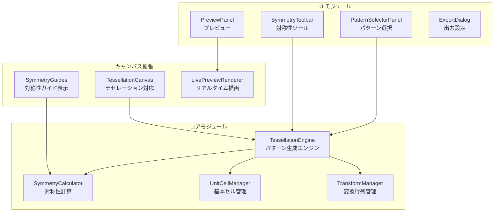

# テセレーション（繰り返しパターン）専用エディタ改造計画

## 概要

SVG-Edit を全面改造し、壁紙、テキスタイル、タイルデザイン向けの繰り返しパターン専用エディタを構築する計画書。

### 目標

1. **シームレスパターン作成** - 継ぎ目のない繰り返しパターンを直感的に作成
2. **数学的対称性サポート** - 17種の壁紙群を含む対称性パターンの完全サポート
3. **リアルタイムプレビュー** - 編集中に無限繰り返しのプレビュー表示
4. **多様な出力形式** - SVG、PNG、CSS パターン、印刷用データへの出力

---

## システムアーキテクチャ

### 全体構成

```
┌─────────────────────────────────────────────────────────────────┐
│                    Tessellation Editor                          │
├─────────────────────────────────────────────────────────────────┤
│                                                                 │
│  ┌─────────────┐  ┌─────────────────────┐  ┌────────────────┐  │
│  │ Pattern     │  │   Unit Cell         │  │ Preview        │  │
│  │ Selector    │  │   Editor            │  │ Panel          │  │
│  │             │  │   (Main Canvas)     │  │                │  │
│  │ - 17 Groups │  │                     │  │ - Infinite     │  │
│  │ - Custom    │  │   ┌───────────┐     │  │   Tiling       │  │
│  │ - Presets   │  │   │ Symmetry  │     │  │ - Zoom/Pan     │  │
│  │             │  │   │ Guides    │     │  │ - Export       │  │
│  └─────────────┘  │   └───────────┘     │  └────────────────┘  │
│                   └─────────────────────┘                       │
│                                                                 │
│  ┌──────────────────────────────────────────────────────────┐  │
│  │                    Symmetry Toolbar                       │  │
│  │  [Mirror] [Rotate] [Glide] [Reflect] [Kaleidoscope]      │  │
│  └──────────────────────────────────────────────────────────┘  │
│                                                                 │
└─────────────────────────────────────────────────────────────────┘
```

### モジュール構成



---

## 機能設計

### 1. 対称性パターン（17種の壁紙群）

#### 壁紙群の分類

| 記号 | 名称 | 回転 | 鏡映 | 滑り鏡映 | 説明 |
|------|------|------|------|----------|------|
| p1 | 平行移動のみ | なし | なし | なし | 最もシンプル |
| p2 | 2回回転 | 180° | なし | なし | 2回対称 |
| pm | 鏡映 | なし | 平行 | なし | 平行な鏡映軸 |
| pg | 滑り鏡映 | なし | なし | あり | 滑り鏡映のみ |
| cm | 鏡映+滑り | なし | 平行 | あり | 菱形格子 |
| pmm | 直交鏡映 | 180° | 直交 | なし | 直交する鏡映軸 |
| pmg | 鏡映+滑り+回転 | 180° | 平行 | 直交 | 複合対称 |
| pgg | 滑り鏡映+回転 | 180° | なし | 直交 | 直交する滑り鏡映 |
| cmm | 菱形+鏡映 | 180° | 直交 | あり | 菱形セル |
| p4 | 4回回転 | 90° | なし | なし | 正方形対称 |
| p4m | 4回+鏡映 | 90° | あり | あり | 正方形+対角鏡映 |
| p4g | 4回+滑り | 90° | あり | あり | 正方形+滑り |
| p3 | 3回回転 | 120° | なし | なし | 六角形対称 |
| p3m1 | 3回+鏡映(1) | 120° | あり | なし | 三角格子+鏡映 |
| p31m | 3回+鏡映(2) | 120° | あり | なし | 回転中心に鏡映 |
| p6 | 6回回転 | 60° | なし | なし | 六角形回転 |
| p6m | 6回+鏡映 | 60° | あり | あり | 最高対称性 |

#### 実装クラス

```javascript
// packages/tessellation/core/symmetry-groups.js

export const WallpaperGroups = {
  p1: {
    name: 'p1',
    displayName: '平行移動 (p1)',
    lattice: 'oblique',
    rotations: [],
    reflections: [],
    glideReflections: [],
    fundamentalDomain: (width, height) => ({
      type: 'rectangle',
      width,
      height
    }),
    generateTransforms: (cellWidth, cellHeight, repeatX, repeatY) => {
      const transforms = []
      for (let x = -repeatX; x <= repeatX; x++) {
        for (let y = -repeatY; y <= repeatY; y++) {
          transforms.push({
            translate: [x * cellWidth, y * cellHeight],
            rotate: 0,
            scale: [1, 1]
          })
        }
      }
      return transforms
    }
  },

  p4m: {
    name: 'p4m',
    displayName: '正方形+対角鏡映 (p4m)',
    lattice: 'square',
    rotations: [90, 180, 270],
    reflections: ['horizontal', 'vertical', 'diagonal1', 'diagonal2'],
    glideReflections: [],
    fundamentalDomain: (size) => ({
      type: 'triangle',
      vertices: [[0, 0], [size/2, 0], [size/2, size/2]]
    }),
    generateTransforms: (cellSize, repeatX, repeatY) => {
      const transforms = []
      // 基本セル内の8つの対称コピー
      const symmetryOps = [
        { rotate: 0, scale: [1, 1] },
        { rotate: 90, scale: [1, 1] },
        { rotate: 180, scale: [1, 1] },
        { rotate: 270, scale: [1, 1] },
        { rotate: 0, scale: [-1, 1] },
        { rotate: 90, scale: [-1, 1] },
        { rotate: 180, scale: [-1, 1] },
        { rotate: 270, scale: [-1, 1] }
      ]

      for (let x = -repeatX; x <= repeatX; x++) {
        for (let y = -repeatY; y <= repeatY; y++) {
          for (const op of symmetryOps) {
            transforms.push({
              translate: [x * cellSize, y * cellSize],
              rotate: op.rotate,
              scale: op.scale,
              origin: [cellSize/2, cellSize/2]
            })
          }
        }
      }
      return transforms
    }
  },

  p6m: {
    name: 'p6m',
    displayName: '六角形+鏡映 (p6m)',
    lattice: 'hexagonal',
    rotations: [60, 120, 180, 240, 300],
    reflections: ['axis1', 'axis2', 'axis3', 'axis4', 'axis5', 'axis6'],
    fundamentalDomain: (size) => ({
      type: 'triangle',
      vertices: [[0, 0], [size/2, 0], [size/4, size * Math.sqrt(3)/4]]
    }),
    generateTransforms: (cellSize, repeatX, repeatY) => {
      // 六角形格子の変換行列を生成
      // ...
    }
  }
  // ... 他14種の壁紙群
}
```

### 2. 基本セル（Unit Cell）エディタ

#### UI レイアウト

```
┌─────────────────────────────────────────────────────────────┐
│  Unit Cell Editor                                           │
├─────────────────────────────────────────────────────────────┤
│                                                             │
│    ┌─────────────────────────────────────────────┐         │
│    │           Fundamental Domain                 │         │
│    │     (編集可能領域)                           │         │
│    │                                             │         │
│    │         ╔═══════════════╗                   │         │
│    │         ║               ║                   │         │
│    │         ║   描画領域    ║                   │         │
│    │         ║               ║                   │         │
│    │         ╚═══════════════╝                   │         │
│    │                                             │         │
│    │  - - - - - - - - - - - - - - - - - - - - - │         │
│    │  ：対称性によるゴースト表示                 ：         │
│    │  - - - - - - - - - - - - - - - - - - - - - │         │
│    └─────────────────────────────────────────────┘         │
│                                                             │
│  [Cell Size: 100x100] [Aspect Ratio: 1:1] [Lock ☑]         │
└─────────────────────────────────────────────────────────────┘
```

#### 実装

```javascript
// src/editor/tessellation/UnitCellEditor.js

export class UnitCellEditor {
  constructor(svgCanvas, symmetryGroup) {
    this.svgCanvas = svgCanvas
    this.symmetryGroup = symmetryGroup
    this.cellWidth = 100
    this.cellHeight = 100
    this.fundamentalDomain = null
    this.ghostElements = []
  }

  /**
   * 基本領域を設定
   */
  setFundamentalDomain() {
    const domain = this.symmetryGroup.fundamentalDomain(
      this.cellWidth,
      this.cellHeight
    )
    this.fundamentalDomain = domain
    this.drawDomainBoundary()
  }

  /**
   * 描画時に対称性ゴーストを表示
   */
  updateSymmetryGhosts(element) {
    // 既存のゴーストを削除
    this.clearGhosts()

    // 対称性に基づいてゴースト要素を生成
    const transforms = this.symmetryGroup.generateTransforms(
      this.cellWidth,
      this.cellHeight,
      0, 0  // セル内のみ
    )

    transforms.slice(1).forEach((transform, index) => {
      const ghost = element.cloneNode(true)
      ghost.id = `ghost_${index}`
      ghost.setAttribute('opacity', '0.3')
      ghost.setAttribute('pointer-events', 'none')

      const transformStr = this.buildTransformString(transform)
      ghost.setAttribute('transform', transformStr)

      this.ghostElements.push(ghost)
      this.svgCanvas.svgContent.appendChild(ghost)
    })
  }

  /**
   * セル境界を超えた要素をラップ
   */
  wrapElementAtBoundary(element) {
    const bbox = element.getBBox()
    const wrapped = []

    // 右端からはみ出した部分を左端に複製
    if (bbox.x + bbox.width > this.cellWidth) {
      const clone = element.cloneNode(true)
      clone.setAttribute('transform',
        `translate(${-this.cellWidth}, 0)`)
      wrapped.push(clone)
    }

    // 下端からはみ出した部分を上端に複製
    if (bbox.y + bbox.height > this.cellHeight) {
      const clone = element.cloneNode(true)
      clone.setAttribute('transform',
        `translate(0, ${-this.cellHeight})`)
      wrapped.push(clone)
    }

    // 角の処理
    if (bbox.x + bbox.width > this.cellWidth &&
        bbox.y + bbox.height > this.cellHeight) {
      const clone = element.cloneNode(true)
      clone.setAttribute('transform',
        `translate(${-this.cellWidth}, ${-this.cellHeight})`)
      wrapped.push(clone)
    }

    return wrapped
  }
}
```

### 3. リアルタイムプレビューパネル

```javascript
// src/editor/panels/TessellationPreviewPanel.js

export class TessellationPreviewPanel {
  constructor(editor) {
    this.editor = editor
    this.previewCanvas = null
    this.repeatX = 5
    this.repeatY = 5
    this.zoom = 0.5
    this.panOffset = { x: 0, y: 0 }
  }

  /**
   * プレビューパネルを初期化
   */
  init() {
    this.createPreviewCanvas()
    this.setupEventListeners()
  }

  /**
   * プレビューキャンバスを作成
   */
  createPreviewCanvas() {
    const container = document.getElementById('preview_container')

    // WebGL または Canvas2D を使用（パフォーマンス最適化）
    this.previewCanvas = document.createElement('canvas')
    this.previewCanvas.id = 'tessellation_preview'
    this.previewCanvas.width = 400
    this.previewCanvas.height = 400

    container.appendChild(this.previewCanvas)
    this.ctx = this.previewCanvas.getContext('2d')
  }

  /**
   * プレビューを更新
   */
  updatePreview() {
    const unitCell = this.editor.unitCellEditor
    const svgString = this.editor.svgCanvas.getSvgString()

    // SVG を画像に変換
    const img = new Image()
    const blob = new Blob([svgString], { type: 'image/svg+xml' })
    const url = URL.createObjectURL(blob)

    img.onload = () => {
      this.ctx.clearRect(0, 0,
        this.previewCanvas.width,
        this.previewCanvas.height)

      // 繰り返し描画
      const transforms = unitCell.symmetryGroup.generateTransforms(
        unitCell.cellWidth,
        unitCell.cellHeight,
        this.repeatX,
        this.repeatY
      )

      this.ctx.save()
      this.ctx.translate(
        this.previewCanvas.width / 2 + this.panOffset.x,
        this.previewCanvas.height / 2 + this.panOffset.y
      )
      this.ctx.scale(this.zoom, this.zoom)

      transforms.forEach(transform => {
        this.ctx.save()
        this.ctx.translate(transform.translate[0], transform.translate[1])
        if (transform.rotate) {
          this.ctx.rotate(transform.rotate * Math.PI / 180)
        }
        if (transform.scale) {
          this.ctx.scale(transform.scale[0], transform.scale[1])
        }
        this.ctx.drawImage(img,
          -unitCell.cellWidth / 2,
          -unitCell.cellHeight / 2,
          unitCell.cellWidth,
          unitCell.cellHeight)
        this.ctx.restore()
      })

      this.ctx.restore()
      URL.revokeObjectURL(url)
    }

    img.src = url
  }

  /**
   * WebGL を使用した高速レンダリング（オプション）
   */
  updatePreviewWebGL() {
    // 大量のタイルを効率的に描画するための WebGL 実装
    // インスタンシングを使用して GPU で並列描画
  }
}
```

### 4. 対称性ツールバー

```javascript
// src/editor/panels/SymmetryToolbar.js

export class SymmetryToolbar {
  constructor(editor) {
    this.editor = editor
    this.tools = [
      'mirror_horizontal',
      'mirror_vertical',
      'mirror_diagonal',
      'rotate_90',
      'rotate_180',
      'rotate_120',
      'rotate_60',
      'kaleidoscope',
      'glide_reflect'
    ]
  }

  /**
   * ツールバー HTML を生成
   */
  render() {
    return `
      <div id="symmetry_toolbar" class="symmetry-toolbar">
        <div class="toolbar-section">
          <span class="section-label">ミラー</span>
          <se-button id="mirror_h" title="水平ミラー" src="mirror_h.svg"></se-button>
          <se-button id="mirror_v" title="垂直ミラー" src="mirror_v.svg"></se-button>
          <se-button id="mirror_d" title="対角ミラー" src="mirror_d.svg"></se-button>
        </div>

        <div class="toolbar-section">
          <span class="section-label">回転</span>
          <se-button id="rotate_90" title="90°回転" src="rotate_90.svg"></se-button>
          <se-button id="rotate_180" title="180°回転" src="rotate_180.svg"></se-button>
          <se-button id="rotate_120" title="120°回転" src="rotate_120.svg"></se-button>
          <se-button id="rotate_60" title="60°回転" src="rotate_60.svg"></se-button>
        </div>

        <div class="toolbar-section">
          <span class="section-label">特殊</span>
          <se-button id="kaleidoscope" title="万華鏡" src="kaleidoscope.svg"></se-button>
          <se-button id="glide" title="滑り鏡映" src="glide.svg"></se-button>
        </div>

        <div class="toolbar-section">
          <span class="section-label">パターン</span>
          <se-select id="wallpaper_group">
            <option value="p1">p1 - 平行移動</option>
            <option value="p2">p2 - 2回回転</option>
            <option value="pm">pm - 鏡映</option>
            <option value="p4m">p4m - 正方形+鏡映</option>
            <option value="p6m">p6m - 六角形+鏡映</option>
            <!-- 他の壁紙群 -->
          </se-select>
        </div>
      </div>
    `
  }

  /**
   * ミラーツールを適用
   */
  applyMirror(axis) {
    const selected = this.editor.svgCanvas.getSelectedElements()
    if (!selected.length) return

    const unitCell = this.editor.unitCellEditor
    const centerX = unitCell.cellWidth / 2
    const centerY = unitCell.cellHeight / 2

    selected.forEach(elem => {
      const clone = elem.cloneNode(true)
      clone.id = this.editor.svgCanvas.getNextId()

      let transform = ''
      switch (axis) {
        case 'horizontal':
          transform = `translate(${centerX * 2}, 0) scale(-1, 1)`
          break
        case 'vertical':
          transform = `translate(0, ${centerY * 2}) scale(1, -1)`
          break
        case 'diagonal':
          transform = `matrix(0, 1, 1, 0, 0, 0)`
          break
      }

      clone.setAttribute('transform', transform)
      this.editor.svgCanvas.svgContent.appendChild(clone)
    })
  }

  /**
   * 回転コピーを作成
   */
  applyRotation(angle, copies = 1) {
    const selected = this.editor.svgCanvas.getSelectedElements()
    if (!selected.length) return

    const unitCell = this.editor.unitCellEditor
    const centerX = unitCell.cellWidth / 2
    const centerY = unitCell.cellHeight / 2

    for (let i = 1; i <= copies; i++) {
      const rotateAngle = angle * i

      selected.forEach(elem => {
        const clone = elem.cloneNode(true)
        clone.id = this.editor.svgCanvas.getNextId()

        const transform = `rotate(${rotateAngle}, ${centerX}, ${centerY})`
        clone.setAttribute('transform', transform)

        this.editor.svgCanvas.svgContent.appendChild(clone)
      })
    }
  }

  /**
   * 万華鏡効果
   */
  applyKaleidoscope(segments = 6) {
    const selected = this.editor.svgCanvas.getSelectedElements()
    if (!selected.length) return

    const unitCell = this.editor.unitCellEditor
    const centerX = unitCell.cellWidth / 2
    const centerY = unitCell.cellHeight / 2
    const angleStep = 360 / segments

    selected.forEach(elem => {
      for (let i = 1; i < segments; i++) {
        // 回転コピー
        const rotateClone = elem.cloneNode(true)
        rotateClone.id = this.editor.svgCanvas.getNextId()
        rotateClone.setAttribute('transform',
          `rotate(${angleStep * i}, ${centerX}, ${centerY})`)
        this.editor.svgCanvas.svgContent.appendChild(rotateClone)

        // ミラー + 回転コピー
        const mirrorClone = elem.cloneNode(true)
        mirrorClone.id = this.editor.svgCanvas.getNextId()
        mirrorClone.setAttribute('transform',
          `rotate(${angleStep * i}, ${centerX}, ${centerY}) scale(-1, 1) translate(${-centerX * 2}, 0)`)
        this.editor.svgCanvas.svgContent.appendChild(mirrorClone)
      }
    })
  }
}
```

### 5. エクスポート機能

```javascript
// src/editor/dialogs/TessellationExportDialog.js

export class TessellationExportDialog {
  constructor(editor) {
    this.editor = editor
    this.formats = ['svg', 'png', 'jpeg', 'css', 'pdf']
    this.tileOptions = {
      repeatX: 3,
      repeatY: 3,
      includeMetadata: true
    }
  }

  /**
   * SVG パターン要素として出力
   */
  exportAsSvgPattern() {
    const unitCell = this.editor.unitCellEditor
    const content = this.editor.svgCanvas.getSvgString()

    const patternSvg = `
      <svg xmlns="http://www.w3.org/2000/svg"
           width="100%" height="100%">
        <defs>
          <pattern id="tessellation-pattern"
                   patternUnits="userSpaceOnUse"
                   width="${unitCell.cellWidth}"
                   height="${unitCell.cellHeight}">
            ${this.extractSvgContent(content)}
          </pattern>
        </defs>
        <rect width="100%" height="100%"
              fill="url(#tessellation-pattern)"/>
      </svg>
    `
    return patternSvg
  }

  /**
   * CSS background-image として出力
   */
  exportAsCssPattern() {
    const svgPattern = this.exportAsSvgPattern()
    const encoded = btoa(unescape(encodeURIComponent(svgPattern)))

    return `
      .tessellation-pattern {
        background-image: url("data:image/svg+xml;base64,${encoded}");
        background-repeat: repeat;
        background-size: ${this.editor.unitCellEditor.cellWidth}px
                         ${this.editor.unitCellEditor.cellHeight}px;
      }
    `
  }

  /**
   * 指定サイズの PNG として出力
   */
  async exportAsPng(width, height, repeat = true) {
    const canvas = document.createElement('canvas')
    canvas.width = width
    canvas.height = height
    const ctx = canvas.getContext('2d')

    const unitCell = this.editor.unitCellEditor
    const svgString = this.editor.svgCanvas.getSvgString()

    const img = new Image()
    const blob = new Blob([svgString], { type: 'image/svg+xml' })
    const url = URL.createObjectURL(blob)

    return new Promise((resolve, reject) => {
      img.onload = () => {
        if (repeat) {
          // タイル状に繰り返し描画
          const transforms = unitCell.symmetryGroup.generateTransforms(
            unitCell.cellWidth,
            unitCell.cellHeight,
            Math.ceil(width / unitCell.cellWidth),
            Math.ceil(height / unitCell.cellHeight)
          )

          transforms.forEach(transform => {
            ctx.save()
            ctx.translate(
              width / 2 + transform.translate[0],
              height / 2 + transform.translate[1]
            )
            if (transform.rotate) {
              ctx.rotate(transform.rotate * Math.PI / 180)
            }
            if (transform.scale) {
              ctx.scale(transform.scale[0], transform.scale[1])
            }
            ctx.drawImage(img,
              -unitCell.cellWidth / 2,
              -unitCell.cellHeight / 2,
              unitCell.cellWidth,
              unitCell.cellHeight)
            ctx.restore()
          })
        } else {
          ctx.drawImage(img, 0, 0, width, height)
        }

        URL.revokeObjectURL(url)
        canvas.toBlob(blob => resolve(blob), 'image/png')
      }
      img.onerror = reject
      img.src = url
    })
  }

  /**
   * シームレステクスチャとして出力
   */
  async exportAsSeamlessTexture(size) {
    // 1セル分の PNG を出力（シームレスになるよう調整済み）
    return this.exportAsPng(
      this.editor.unitCellEditor.cellWidth,
      this.editor.unitCellEditor.cellHeight,
      false
    )
  }

  /**
   * 印刷用 PDF として出力
   */
  async exportAsPdf(pageSize, repeatCount) {
    // jsPDF を使用して印刷用 PDF を生成
    const { jsPDF } = await import('jspdf')
    const doc = new jsPDF({
      orientation: 'portrait',
      unit: 'mm',
      format: pageSize
    })

    // パターンを指定回数繰り返して PDF に描画
    // ...

    return doc.output('blob')
  }
}
```

---

## UI/UX 設計

### メインレイアウト

```
┌─────────────────────────────────────────────────────────────────────┐
│  File  Edit  View  Pattern  Symmetry  Export  Help                  │
├───────────┬─────────────────────────────────────────┬───────────────┤
│           │                                         │               │
│  Pattern  │                                         │   Preview     │
│  Library  │                                         │               │
│           │         Unit Cell Editor                │   ┌───────┐   │
│  ┌─────┐  │                                         │   │ ∙ ∙ ∙ │   │
│  │ p1  │  │         ┌─────────────────┐             │   │ ∙ ∙ ∙ │   │
│  │ p2  │  │         │                 │             │   │ ∙ ∙ ∙ │   │
│  │ pm  │  │         │   Editable      │             │   └───────┘   │
│  │ pg  │  │         │   Area          │             │               │
│  │ cm  │  │         │                 │             │   Repeat:     │
│  │ ... │  │         └─────────────────┘             │   X: [5]      │
│  └─────┘  │                                         │   Y: [5]      │
│           │  ┌─────────────────────────────────┐    │               │
│  Presets  │  │   Symmetry Guides (ghost)       │    │   Zoom:       │
│  ┌─────┐  │  └─────────────────────────────────┘    │   [====●==]   │
│  │ □□□ │  │                                         │               │
│  │ ◇◇◇ │  │                                         │   [Export]    │
│  │ ○○○ │  │                                         │               │
│  └─────┘  │                                         │               │
├───────────┴─────────────────────────────────────────┴───────────────┤
│  [Mirror H] [Mirror V] [Rotate 90°] [Kaleidoscope]  │ Cell: 100x100 │
└─────────────────────────────────────────────────────────────────────┘
```

### カラースキーム

```css
:root {
  /* 背景 */
  --tess-bg-primary: #1a1a2e;
  --tess-bg-secondary: #16213e;
  --tess-bg-canvas: #0f0f23;

  /* アクセント */
  --tess-accent-primary: #e94560;
  --tess-accent-secondary: #533483;

  /* ガイドライン */
  --tess-guide-symmetry: rgba(233, 69, 96, 0.5);
  --tess-guide-cell-boundary: rgba(255, 255, 255, 0.3);
  --tess-guide-ghost: rgba(255, 255, 255, 0.2);

  /* テキスト */
  --tess-text-primary: #ffffff;
  --tess-text-secondary: #a0a0a0;
}
```

---

## 実装フェーズ

### Phase 1: 基盤構築（2週間相当の作業量）

#### 1.1 コアエンジン

- [ ] `TessellationEngine` クラスの実装
- [ ] 17種の壁紙群の数学的定義
- [ ] 変換行列生成アルゴリズム
- [ ] 基本領域（Fundamental Domain）計算

#### 1.2 既存コードの修正

- [ ] `SvgCanvas` の拡張（テセレーションモード追加）
- [ ] `Editor.js` のレイアウト変更
- [ ] 不要なツールの削除/非表示化

### Phase 2: UI 構築（2週間相当の作業量）

#### 2.1 パネル実装

- [ ] `PatternSelectorPanel` - 壁紙群選択
- [ ] `UnitCellEditor` - 基本セル編集
- [ ] `TessellationPreviewPanel` - リアルタイムプレビュー
- [ ] `SymmetryToolbar` - 対称性ツール

#### 2.2 ダイアログ

- [ ] `TessellationExportDialog` - エクスポート設定
- [ ] `PatternSettingsDialog` - パターン詳細設定
- [ ] `PresetLibraryDialog` - プリセット管理

### Phase 3: 対称性ツール（2週間相当の作業量）

#### 3.1 基本ツール

- [ ] ミラーツール（水平/垂直/対角）
- [ ] 回転ツール（90°/180°/120°/60°）
- [ ] 滑り鏡映ツール

#### 3.2 高度なツール

- [ ] 万華鏡ツール
- [ ] 自動対称性検出
- [ ] カスタム対称点設定

### Phase 4: エクスポート機能（1週間相当の作業量）

- [ ] SVG パターン出力
- [ ] PNG/JPEG 出力（任意サイズ）
- [ ] CSS パターン生成
- [ ] PDF 印刷出力
- [ ] シームレステクスチャ出力

### Phase 5: 最適化とポリッシュ（1週間相当の作業量）

- [ ] WebGL プレビューレンダラー
- [ ] パフォーマンス最適化
- [ ] レスポンシブ対応
- [ ] アクセシビリティ対応
- [ ] ドキュメント作成

---

## ファイル構成

```
src/
├── editor/
│   ├── TessellationEditor.js          # メインエディタクラス
│   ├── TessellationEditorStartup.js   # 起動処理
│   │
│   ├── tessellation/
│   │   ├── TessellationEngine.js      # パターン生成エンジン
│   │   ├── SymmetryCalculator.js      # 対称性計算
│   │   ├── UnitCellManager.js         # 基本セル管理
│   │   └── TransformGenerator.js      # 変換行列生成
│   │
│   ├── panels/
│   │   ├── PatternSelectorPanel.js    # パターン選択パネル
│   │   ├── TessellationPreviewPanel.js # プレビューパネル
│   │   ├── SymmetryToolbar.js         # 対称性ツールバー
│   │   └── UnitCellPanel.js           # セル設定パネル
│   │
│   ├── dialogs/
│   │   ├── TessellationExportDialog.js # エクスポート
│   │   ├── PatternSettingsDialog.js    # パターン設定
│   │   └── PresetLibraryDialog.js      # プリセット管理
│   │
│   ├── components/
│   │   ├── seSymmetryButton.js        # 対称性ボタン
│   │   ├── sePatternThumbnail.js      # パターンサムネイル
│   │   └── sePreviewCanvas.js         # プレビューキャンバス
│   │
│   └── locale/
│       ├── lang.en.tessellation.js
│       └── lang.ja.tessellation.js
│
├── packages/
│   └── tessellation/
│       ├── core/
│       │   ├── symmetry-groups.js     # 17種壁紙群定義
│       │   ├── lattice.js             # 格子計算
│       │   ├── fundamental-domain.js   # 基本領域
│       │   └── transforms.js          # 変換操作
│       │
│       ├── presets/
│       │   ├── geometric.js           # 幾何学パターン
│       │   ├── floral.js              # 花柄パターン
│       │   └── abstract.js            # 抽象パターン
│       │
│       └── index.js
│
└── styles/
    └── tessellation.css               # テセレーション固有スタイル
```

---

## 削除/変更するファイル

### 削除対象

| ファイル | 理由 |
|---------|------|
| `src/editor/extensions/ext-connector/` | コネクタ機能は不要 |
| `src/editor/extensions/ext-markers/` | マーカー機能は不要 |
| `src/editor/extensions/ext-polystar/` | 統合して新実装 |
| `src/editor/extensions/ext-shapes/` | 統合して新実装 |
| `src/editor/panels/LayersPanel.js` | レイヤー概念を変更 |

### 大幅変更対象

| ファイル | 変更内容 |
|---------|---------|
| `src/editor/Editor.js` | テセレーションエディタとして再構築 |
| `src/editor/EditorStartup.js` | 初期化フローの変更 |
| `src/editor/panels/TopPanel.js` | 対称性ツールバーに変更 |
| `src/editor/panels/LeftPanel.js` | パターン選択パネルに変更 |
| `src/editor/panels/BottomPanel.js` | セル設定パネルに変更 |
| `src/editor/svgedit.css` | 新UIスタイルに変更 |

### 維持するファイル

| ファイル | 理由 |
|---------|------|
| `packages/svgcanvas/` | コア SVG 操作機能は維持 |
| `src/editor/components/` | Web Components は再利用 |
| `src/editor/extensions/ext-eyedropper/` | 色抽出は有用 |
| `src/editor/extensions/ext-opensave/` | ファイル操作は必要 |
| `src/editor/extensions/ext-storage/` | 自動保存は有用 |

---

## 技術的課題と解決策

### 課題 1: リアルタイムプレビューのパフォーマンス

**問題:** 数百〜数千のタイルを毎フレーム描画するのは負荷が高い

**解決策:**
1. **WebGL インスタンシング** - GPU で並列描画
2. **仮想化** - 表示領域のみ描画
3. **キャッシュ** - 変更がない部分はキャッシュを使用
4. **LOD** - ズームアウト時は低解像度で描画

```javascript
// WebGL インスタンシング例
class WebGLTileRenderer {
  constructor(canvas) {
    this.gl = canvas.getContext('webgl2')
    this.instanceCount = 0
    this.initShaders()
    this.initBuffers()
  }

  render(tileTexture, transforms) {
    // インスタンス変換行列をバッファに設定
    this.updateInstanceBuffer(transforms)

    // 1回のドローコールで全タイルを描画
    this.gl.drawArraysInstanced(
      this.gl.TRIANGLE_STRIP,
      0, 4,
      transforms.length
    )
  }
}
```

### 課題 2: 対称性境界での要素のシームレス処理

**問題:** セル境界をまたぐ要素の処理

**解決策:**
1. **ラッピング** - 境界を超えた部分を反対側に複製
2. **クリッピング** - 基本領域内でクリップして複製
3. **座標変換** - 要素の座標をセル座標系に正規化

```javascript
// 座標の正規化
function normalizeToCell(x, y, cellWidth, cellHeight) {
  return {
    x: ((x % cellWidth) + cellWidth) % cellWidth,
    y: ((y % cellHeight) + cellHeight) % cellHeight
  }
}
```

### 課題 3: 複雑な対称性の正確な計算

**問題:** p6m などの複雑な壁紙群の正確な変換

**解決策:**
1. **行列ベースの計算** - すべての対称操作を行列で表現
2. **群論ライブラリ** - 数学的に正確な実装
3. **単体テスト** - 各壁紙群の出力を検証

---

## テスト計画

### ユニットテスト

```javascript
// tests/unit/tessellation/symmetry-groups.test.js

describe('WallpaperGroups', () => {
  describe('p4m', () => {
    it('should generate 8 transforms per cell', () => {
      const transforms = WallpaperGroups.p4m.generateTransforms(100, 0, 0)
      expect(transforms.length).toBe(8)
    })

    it('should include 90° rotations', () => {
      const transforms = WallpaperGroups.p4m.generateTransforms(100, 0, 0)
      const rotations = transforms.map(t => t.rotate)
      expect(rotations).toContain(90)
      expect(rotations).toContain(180)
      expect(rotations).toContain(270)
    })

    it('should include mirror reflections', () => {
      const transforms = WallpaperGroups.p4m.generateTransforms(100, 0, 0)
      const hasHorizontalMirror = transforms.some(
        t => t.scale[0] === -1 && t.scale[1] === 1
      )
      expect(hasHorizontalMirror).toBe(true)
    })
  })
})
```

### E2E テスト

```javascript
// tests/e2e/tessellation.spec.js

test('create simple p1 pattern', async ({ page }) => {
  await page.goto('/tessellation-editor')

  // パターン選択
  await page.click('#pattern_p1')

  // 矩形を描画
  await page.click('#tool_rect')
  await page.mouse.move(100, 100)
  await page.mouse.down()
  await page.mouse.move(150, 150)
  await page.mouse.up()

  // プレビューを確認
  const preview = page.locator('#tessellation_preview')
  await expect(preview).toBeVisible()

  // エクスポート
  await page.click('#export_btn')
  await page.click('#export_svg')

  // ダウンロードを確認
  const download = await page.waitForEvent('download')
  expect(download.suggestedFilename()).toMatch(/\.svg$/)
})
```

---

## 参考資料

### 数学的背景

- [Wallpaper Groups - Wikipedia](https://en.wikipedia.org/wiki/Wallpaper_group)
- [The 17 Wallpaper Groups](https://www.math.toronto.edu/~drorbn/Gallery/Symmetry/Tilings/Sanderson/index.html)
- [Symmetry in Crystallography](https://www.iucr.org/education/pamphlets/9)

### 類似ソフトウェア

- [Repper](https://repper.app/) - Web ベースのパターン作成ツール
- [Artlandia SymmetryWorks](https://www.artlandia.com/) - Illustrator プラグイン
- [Kaleidoscope](https://www.escapemotions.com/products/kaleidosketch) - デジタルアート向け

### 技術資料

- [WebGL Instancing](https://webgl2fundamentals.org/webgl/lessons/webgl-instanced-drawing.html)
- [SVG Pattern Element](https://developer.mozilla.org/en-US/docs/Web/SVG/Element/pattern)
- [CSS Patterns](https://css-tricks.com/css3-patterns-explained/)
